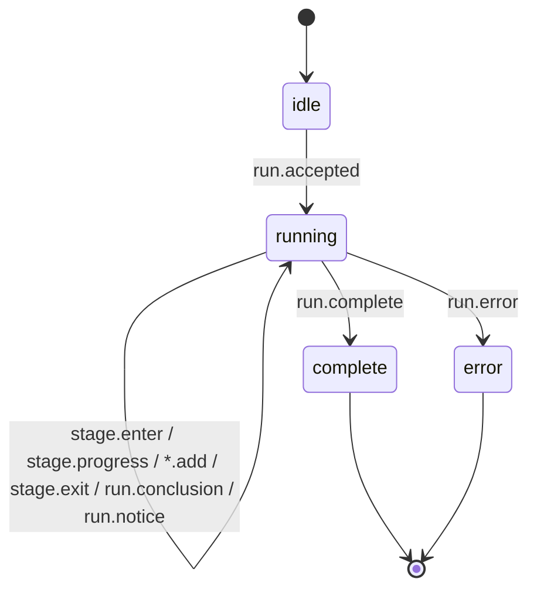

# Deep Research state machine

> Streaming state machine for the public Deep Research page (`apps/web` `/research`). Chinese source: [`deep-research-state-machine.md`](deep-research-state-machine.md).
>
> Last updated: 2026-06-14

## In one line

A user asks a verifiable binary event in natural language → the backend streams seven steps of events → the frontend folds them through one pure reducer into visualised state → it renders the conclusion charts. **The protocol lives in `apps/web/lib/research/events.ts`, the machine in `apps/web/lib/research/state-machine.ts`; both ends share the same reducer.**

## Two nested machines

### 1. Run phase

```
idle ──run.accepted──▶ running ──run.complete──▶ complete
                          └────── run.error ────▶ error
```

### 2. Per-stage status

```
pending ──stage.enter──▶ active ──stage.exit──▶ complete
```

The seven stages come from the existing `PredictionEngineRun.stages`: define → reason & query → gather evidence → weight evidence → structured model → Bayesian update → conclusion & market gap. Exactly one stage is `active` at a time (Manus-style highlight); `stage.enter` defensively demotes any lingering active stage to complete.

## Event protocol (SSE, in order)

| Event | Purpose | Reducer effect |
| --- | --- | --- |
| `run.accepted` | runId / question / driver / all stage metadata | `idle → running`, lay out all pending stages |
| `stage.enter` | enter a stage | that stage `→ active`, others `→ complete` |
| `stage.progress` | one "what it's doing" narration line | append to the stage's progressLines |
| `evidence.add` / `model.add` / `update.add` | stream structured artifacts | accumulate into evidence / model / updates |
| `stage.exit` | leave a stage | `→ complete`, record outcome / artifactLabel / duration |
| `run.conclusion` | final probability + 80% CI + edge | store conclusion |
| `run.complete` | full `PredictionEngineRun` | `running → complete`, backfill chart data |
| `run.notice` | info/warn (e.g. driver fallback) | append notice, phase unchanged |
| `run.error` | terminate | `→ error`, clear active stage |



## Three driver chains (same protocol, transparent to the UI)

- **mock** (default, zero config): `buildPredictionDemoRun` produces a deterministic run, replayed on the timeline above.
- **Chain B / api**: `fetch` streaming straight to Anthropic / OpenAI; live narration overlaid on the structured backbone.
- **Chain A / vps**: POST to a VPS endpoint running `provider-runtime` (codex / claude-code / openclaw); passes its SSE through, or replays a returned JSON run.

`RESEARCH_DRIVER` selects the chain; when a live chain is unconfigured a `DriverNotConfiguredError` triggers fallback to mock with a `run.notice`.

## Norns capability tiers

Each run picks one of **Urd (light) / Verdandi (balanced, default) / Skuld (flagship)**: the "推理深度" selector at the top of the composer chooses per run, and `RESEARCH_DEFAULT_TIER` sets the server default. The tier is resolved through the `@autopoly/norns` alias layer to a concrete model + token budget — Chain B picks the model, Chain A forwards `tier` to the VPS, mock just displays it. `tier` travels up on `run.accepted` and the UI shows it as a pill. Full details in the [README "Capability Tiers — Norns"](../../README.md).

## Human review entry points

- Protocol: [`apps/web/lib/research/events.ts`](../../apps/web/lib/research/events.ts)
- Machine: [`apps/web/lib/research/state-machine.ts`](../../apps/web/lib/research/state-machine.ts) (+ `.test.ts`, 7 cases)
- Route: [`apps/web/app/api/research/stream/route.ts`](../../apps/web/app/api/research/stream/route.ts)
- UI: [`apps/web/components/research/`](../../apps/web/components/research/)
