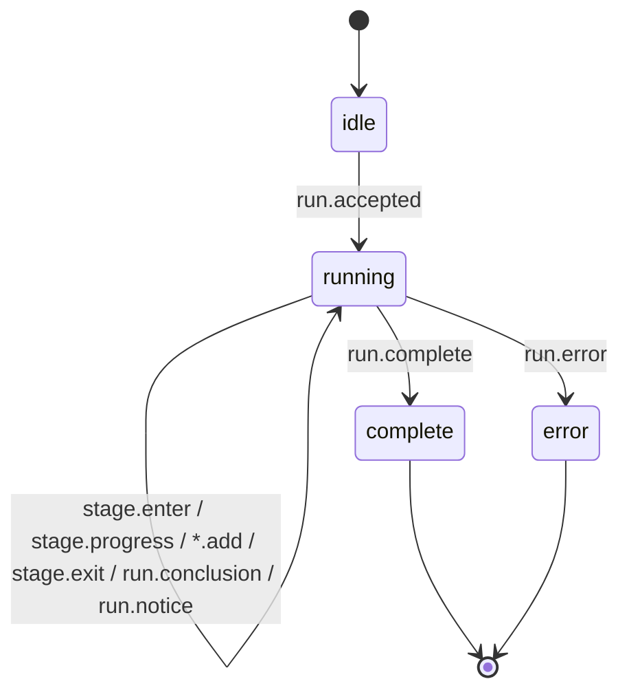

# Deep Research 流转状态机

> C 端 Deep Research 网页（`apps/web` `/research`）的流式状态机定义。英文副本见 [`deep-research-state-machine.en.md`](deep-research-state-machine.en.md)。
>
> 最后更新：2026-06-14

## 一句话

用户用自然语言提出一个可验证的二元事件 → 后端按七步流式吐事件 → 前端用一个纯 reducer 折叠成可视化状态 → 出结论图表。**协议在 `apps/web/lib/research/events.ts`，机器在 `apps/web/lib/research/state-machine.ts`，两端共用同一个 reducer。**

## 两层嵌套状态机

### 1. 运行相位（run phase）

```
idle ──run.accepted──▶ running ──run.complete──▶ complete
                          └────── run.error ────▶ error
```

### 2. 单个 stage 状态（stage status）

```
pending ──stage.enter──▶ active ──stage.exit──▶ complete
```

七个 stage 来自现有 `PredictionEngineRun.stages`：理清定义 → 基础推理与 query → 证据收集 → 证据权重 → 结构化模型 → 贝叶斯更新 → 结论与市场偏差。每次只有一个 stage 处于 `active`（Manus 风格高亮），`stage.enter` 会把上一个 active 兜底降级为 complete。

## 事件协议（SSE，按顺序）

| 事件 | 作用 | reducer 效果 |
| --- | --- | --- |
| `run.accepted` | 携带 runId / 问题 / driver / 全部 stage 元数据 | `idle → running`，铺出全部 pending stage 骨架 |
| `stage.enter` | 进入某 stage | 该 stage `→ active`，其余 active 兜底 `→ complete` |
| `stage.progress` | 一行"正在做什么"叙述 | 追加到该 stage 的 progressLines |
| `evidence.add` / `model.add` / `update.add` | 流式吐结构化产物 | 累加到 evidence / model / updates |
| `stage.exit` | 离开某 stage | 该 stage `→ complete`，记录 outcome / artifactLabel / 耗时 |
| `run.conclusion` | 最终概率 + 80% 置信区间 + edge | 写入 conclusion |
| `run.complete` | 完整 `PredictionEngineRun` | `running → complete`，回填图表缺的数据 |
| `run.notice` | info/warn（如 driver 回退） | 追加 notice，不改相位 |
| `run.error` | 终止 | `→ error`，清空 activeStage |



## 三条驱动链路（同一协议，前端无感知）

- **mock**（默认，零配置）：`buildPredictionDemoRun` 出确定性 run，按上面时序回放。
- **Chain B / api**：`fetch` 直连 Anthropic / OpenAI 流式接口，实时叙述叠加在结构骨架上。
- **Chain A / vps**：POST 到 VPS 上跑 `provider-runtime`（codex / claude-code / openclaw）的端点，透传 SSE 或把返回的 JSON run 回放。

选择由 `RESEARCH_DRIVER` 决定；live 链路未配置时 `DriverNotConfiguredError` 触发回退到 mock 并发 `run.notice`。

## Norns 能力档位

每次研究可选 **Urd（轻快）/ Verdandi（均衡，默认）/ Skuld（旗舰）** 三档：UI 顶部"推理深度"选择器逐次选择，服务端 `RESEARCH_DEFAULT_TIER` 设默认。档位经 `@autopoly/norns` 别名层映射到具体模型 + token 预算——Chain B 据此选模型，Chain A 把 `tier` 透传给 VPS，mock 仅展示档位。`tier` 随 `run.accepted` 上行，前端用 pill 显示当次档位。完整说明见 [README "Capability Tiers — Norns"](../../README.md)。

## 人类 review 入口

- 协议：[`apps/web/lib/research/events.ts`](../../apps/web/lib/research/events.ts)
- 机器：[`apps/web/lib/research/state-machine.ts`](../../apps/web/lib/research/state-machine.ts)（+ 同目录 `.test.ts` 7 条用例）
- 路由：[`apps/web/app/api/research/stream/route.ts`](../../apps/web/app/api/research/stream/route.ts)
- UI：[`apps/web/components/research/`](../../apps/web/components/research/)
