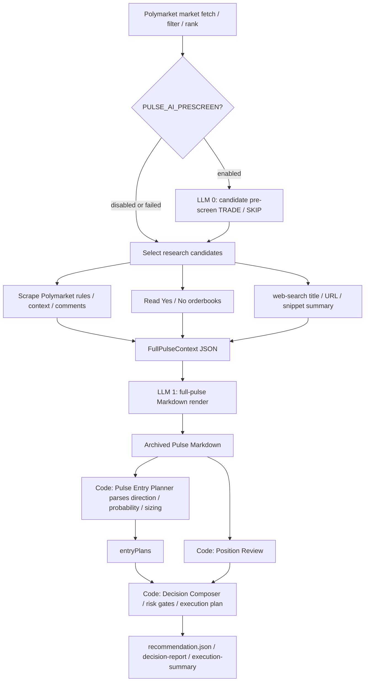
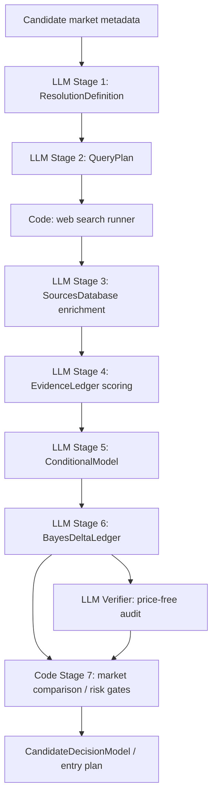

# Pulse LLM Input/Output Flow Map

Last updated: 2026-06-10

This document maps every LLM step in daily Pulse / position-only Pulse: inputs, outputs, persistent artifacts, and current gaps. It is a read-only audit document and does not trigger live trading.

## Human Review Entry Points

- Full report render prompt: [services/orchestrator/src/pulse/full-pulse.ts](../../services/orchestrator/src/pulse/full-pulse.ts)
- Optional candidate pre-screen prompt: [services/orchestrator/src/pulse/pulse-prescreen.ts](../../services/orchestrator/src/pulse/pulse-prescreen.ts)
- typed 7-step artifact definitions: [services/orchestrator/src/pulse/stage-artifacts.ts](../../services/orchestrator/src/pulse/stage-artifacts.ts)
- typed 7-step LLM caller: [services/orchestrator/src/pulse/stage-llm.ts](../../services/orchestrator/src/pulse/stage-llm.ts)
- Current pulse-direct parser/execution entry: [services/orchestrator/src/runtime/pulse-entry-planner.ts](../../services/orchestrator/src/runtime/pulse-entry-planner.ts)

## Current Main Flow

The default `pulse-direct` path is not yet a full typed 7-step pipeline. It first writes a research context JSON, asks one LLM to render a complete Pulse Markdown report, then parses that Markdown in code to produce entry plans.



## Current LLM Calls

| Step | Trigger | LLM input | Prompt source | LLM output | Persistent location | Current issue |
| --- | --- | --- | --- | --- | --- | --- |
| LLM 0: AI pre-screen | `PULSE_AI_PRESCREEN` enabled and candidates are non-empty | Candidate lines: question, slug, category, Yes/No prices, end date, liquidity | `buildPreScreenPrompt()` | Text lines: `TRADE\|market_slug\|reason` or `SKIP\|market_slug\|reason` | Only the parsed `pre_screen` summary is embedded in Pulse context; raw prompt/output temp dir is removed | Lightweight text output, not JSON; failure defaults every candidate to TRADE to avoid false negative filtering |
| LLM 1: Full Pulse report render | Every full Pulse / position-only Pulse run | `full-pulse-prompt.txt` + Pulse Skill + output-template + analysis-framework + FullPulseContext JSON | `buildFullPulsePrompt()` | Markdown report | `runtime-artifacts/reports/pulse/YYYY/MM/DD/pulse-*.md` | This is the core LLM call today; it mixes research explanation, probability estimation, Top 3 packaging, and parser-readable table output |
| LLM 2: Legacy provider runtime | Only for non-`pulse-direct` decision strategies | Pulse JSON, Pulse Markdown, portfolio overview, positions, risk doc, skills, TradeDecisionSet schema | `provider-runtime.ts buildPrompt()` | `TradeDecisionSet` JSON | Enters the runtime result; temp prompt/output dir is removed on success | Not used by the current default path; safety rules are strong, but it requires at least one skip decision |

On successful runs, raw temp prompt files for LLM 0 / LLM 1 / LLM 2 are not retained by default. The durable artifacts are Pulse context JSON, Pulse Markdown, recommendation, and execution reports.

## FullPulseContext JSON

FullPulseContext is the main input to LLM 1. It is written before Markdown rendering.

Typical path:

```text
runtime-artifacts/reports/pulse/YYYY/MM/DD/pulse-<timestamp>-<provider>-<mode>-<runId>.json
```

Example from 2026-06-10:

```text
runtime-artifacts/reports/pulse/2026/06/10/pulse-20260610T105029Z-claude-code-full-5f6bd1c9-fe15-4d75-8d6d-4659da6adcbd.json
runtime-artifacts/reports/pulse/2026/06/10/pulse-20260610T105029Z-claude-code-full-5f6bd1c9-fe15-4d75-8d6d-4659da6adcbd.md
```

Core fields:

| Field | Meaning | LLM usage |
| --- | --- | --- |
| `candidates` | Filtered candidate markets | Candidate-pool explanation and comparison against markets that were not selected |
| `research_candidates` | Deep-research candidates with market, scrapeResult, orderbooks, errors | Main factual source for Top researched / Top 3 sections |
| `web_search` | External search status, queries, results, timeout/failure | Evidence chain and source list; currently mostly title/snippet level |
| `stage_flow` | Current 7-step alignment status and gaps | Instructs the report to organize around stages 1-7, but is not itself a typed 7-step artifact |
| `pre_screen` | Optional AI pre-screen result | Explains whether candidates passed a TRADE/SKIP rough filter |
| `risk_flags` | Pulse-level risk markers | Later blocks or downgrades open actions |

## typed 7-step Target Flow

The codebase already contains typed 7-step producers and schemas, but the current full Pulse archive path still mainly relies on the report prompt and Markdown parsing. The target typed flow is below.



## typed 7-step LLM Inputs and Outputs

| Stage | Model tier | LLM input | LLM output | Code post-processing / validation |
| --- | --- | --- | --- | --- |
| 1. Resolution definition | Sonnet | market slug, event slug, question, Polymarket rules, resolution source, deadline, category; no market price | `ResolutionDefinition`: official question, rules, source, Yes/No boundary, deadline, validationStatus, gaps, confidence | `validateResolutionDefinition()`; missing fields become gaps rather than silent passes |
| 2. Query plan | Sonnet | question, category, tags; no market price | `QueryPlan`: 2-5 necessary-condition nodes, source-specific queries, baseQueries | `stripSpoilerQueries()` removes Polymarket / odds / sportsbook queries; `validateQueryPlan()` checks node/query structure |
| 3. Sources database enrichment | Sonnet | Stage 2 nodes + web search result host/title/snippet | JSON array: sourceCategory, summary, addressedNodeIds for each result | index-keyed alignment; deterministic raw records survive failures; no full page-body fetch yet |
| 4. Evidence ledger | Opus | Stage 3 records + optional Stage 1 resolution; host/category/title/summary | JSON array: direction, strength, primarySource, credibilityScore | Code computes recencyScore and corroborationCount; uncovered records get named defaults and gaps |
| 5. Conditional model | Opus | Stage 1 resolution, Stage 2 nodes, Stage 4 evidence ledger | `ConditionalModel`: conditional nodes, node probabilities, rationale, supporting/contradicting evidence ids, reportedProbability | Code enforces unique node ids, filters missing evidence ids, computes P(A)xP(B\|A)x..., validates arithmetic |
| 6. Bayes delta ledger | Opus | Stage 5 base probability + Stage 4 weighted evidence; no market price | `BayesDeltaLedger`: baseRationale, updates, deltaProbability, credibleInterval | Code filters hallucinated evidence ids and recomputes the posterior chain so base + deltas == final |
| 6b. Verifier | Opus | price-free projection: conditional nodes, Bayes base, updates, final | `{ consistent, issues }` | fail-open second opinion; deterministic validators remain the hard gate |
| 7. Market comparison | Code-first | Stage 6 aiProb, quarantined marketProb, outcomeLabel, orderbook, risk config | entry plan / skip / hold / reduce / close | risk controls, Kelly, minimum trade size, token binding, risk flags, liquidity cap |

Model assignment lives in [services/orchestrator/src/pulse/stage-models.ts](../../services/orchestrator/src/pulse/stage-models.ts).

## What Current Artifacts Let You Inspect

A successful `pulse-direct` run usually exposes:

| File | Content |
| --- | --- |
| `runtime-artifacts/reports/pulse/YYYY/MM/DD/pulse-*.json` | Main input to LLM 1: FullPulseContext |
| `runtime-artifacts/reports/pulse/YYYY/MM/DD/pulse-*.md` | Main output from LLM 1: Pulse Markdown |
| `runtime-artifacts/pulse-live/<ts>-<runId>/recommendation.json` | Final recommendation / decision JSON |
| `runtime-artifacts/pulse-live/<ts>-<runId>/decision-report.md` | Human-readable execution report |
| `runtime-artifacts/pulse-live/<ts>-<runId>/execution-summary.json` | Execution summary |
| `runtime-artifacts/pulse-live/<ts>-<runId>/run-summary.md` | Run summary |
| `runtime-artifacts/pulse-live/<ts>-<runId>/preflight.json` | Account, balance, mode, and preflight status |

Example run directory from 2026-06-10:

```text
runtime-artifacts/pulse-live/2026-06-10T105025Z-5f6bd1c9-fe15-4d75-8d6d-4659da6adcbd/
```

## Raw LLM I/O Not Currently Retained

On successful runs, these are not durably retained by default:

- `autopoly-prescreen-*/prescreen-prompt.txt`
- `autopoly-prescreen-*/prescreen-output.txt`
- `autopoly-pulse-render-*/full-pulse-prompt.txt`
- `autopoly-pulse-render-*/full-pulse-report.md`
- legacy provider runtime `provider-prompt.txt` / `provider-output.json`
- per-stage raw prompt / raw response for the typed 7-step producers, because those producers are not yet fully wired into the current full Pulse main path

If the goal is to replay every LLM input and output for every run, Pulse needs a stable archive directory instead of relying on temp dirs.

## Proposed LLM I/O Archive Format

Each Pulse run should write:

```text
runtime-artifacts/pulse-live/<ts>-<runId>/llm-io/
  manifest.json
  00-prescreen/
    input.txt
    output.txt
    parsed.json
  01-full-pulse-render/
    prompt.txt
    context.json
    output.md
    metrics.json
  typed-stage/<marketSlug>/01-resolution/
    input.json
    prompt.txt
    raw-output.txt
    parsed.json
    validation.json
  typed-stage/<marketSlug>/02-query-plan/
    input.json
    prompt.txt
    raw-output.txt
    parsed.json
    validation.json
  typed-stage/<marketSlug>/03-sources/
    input.json
    prompt.txt
    raw-output.txt
    parsed.json
    validation.json
  typed-stage/<marketSlug>/04-evidence-ledger/
    input.json
    prompt.txt
    raw-output.txt
    parsed.json
    validation.json
  typed-stage/<marketSlug>/05-conditional-model/
    input.json
    prompt.txt
    raw-output.txt
    parsed.json
    validation.json
  typed-stage/<marketSlug>/06-bayes-ledger/
    input.json
    prompt.txt
    raw-output.txt
    parsed.json
    validation.json
  typed-stage/<marketSlug>/06b-verifier/
    input.json
    prompt.txt
    raw-output.txt
    parsed.json
```

Suggested `manifest.json`:

```json
{
  "run_id": "string",
  "generated_at_utc": "string",
  "mode": "recommend-only | live",
  "provider": "claude-code | codex | openclaw",
  "calls": [
    {
      "id": "01-full-pulse-render",
      "stage": "full_pulse_render",
      "model": "string",
      "input_path": "llm-io/01-full-pulse-render/prompt.txt",
      "output_path": "llm-io/01-full-pulse-render/output.md",
      "parsed_path": null,
      "elapsed_ms": 0,
      "status": "completed | failed | timed_out"
    }
  ]
}
```

## Takeaway

The current system has solid candidate collection, context archiving, and execution risk controls. The main intelligence bottleneck is that one full-pulse Markdown render call carries too much responsibility. typed 7-step schemas, prompts, and validators exist, but they are not yet the sole decision interface for daily Pulse.

To make the report closer to expert-human quality and fully auditable:

1. Wire typed 7-step into `buildFullPulseArchive()` or its upstream candidate research stage.
2. Make execution consume `CandidateDecisionModel` / `BayesDeltaLedger`, not Markdown parsing.
3. Archive `prompt`, `raw output`, `parsed JSON`, and `validation` for every LLM call under `llm-io/`.
4. Downgrade full-pulse Markdown to a render-only human explanation layer.
5. Expand verifier checks to cover evidence truth, source sufficiency, market-price anchoring, and executability.
