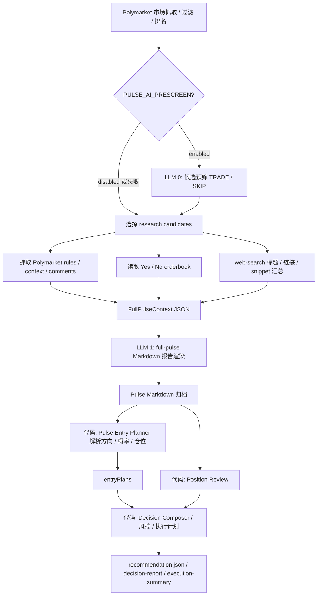
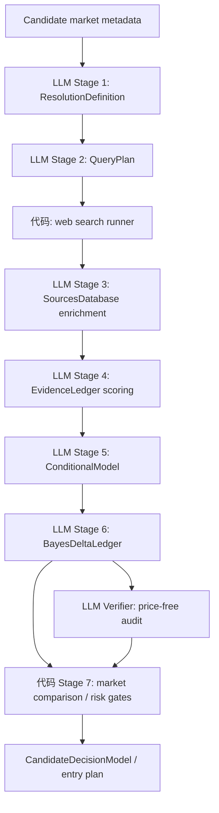

# Pulse LLM 输入输出流转图

最后更新：2026-06-10

本文档说明 daily Pulse / position-only Pulse 中每个 LLM 环节的输入、输出、持久化产物和当前缺口。它是只读审计文档，不会触发实盘交易。

## 人工 Review 入口

- 主报告渲染 prompt：[services/orchestrator/src/pulse/full-pulse.ts](../../services/orchestrator/src/pulse/full-pulse.ts)
- 可选候选预筛 prompt：[services/orchestrator/src/pulse/pulse-prescreen.ts](../../services/orchestrator/src/pulse/pulse-prescreen.ts)
- typed 7-step artifact 定义：[services/orchestrator/src/pulse/stage-artifacts.ts](../../services/orchestrator/src/pulse/stage-artifacts.ts)
- typed 7-step LLM caller：[services/orchestrator/src/pulse/stage-llm.ts](../../services/orchestrator/src/pulse/stage-llm.ts)
- 当前 pulse-direct 解析执行入口：[services/orchestrator/src/runtime/pulse-entry-planner.ts](../../services/orchestrator/src/runtime/pulse-entry-planner.ts)

## 当前主链路

当前默认 `pulse-direct` 主链路不是完整 typed 7-step。它先生成研究上下文 JSON，再让一个 LLM 渲染完整 Pulse Markdown，随后由代码解析 Markdown 生成 entry plan。



## 当前实际 LLM 调用

| 环节 | 触发条件 | LLM 输入 | Prompt 来源 | LLM 输出 | 持久化位置 | 当前问题 |
| --- | --- | --- | --- | --- | --- | --- |
| LLM 0：AI pre-screen | `PULSE_AI_PRESCREEN` 开启且候选非空 | 候选列表：问题、slug、category、Yes/No 价格、结束日、流动性 | `buildPreScreenPrompt()` | 文本行：`TRADE\|market_slug\|reason` 或 `SKIP\|market_slug\|reason` | 成功后只进入 Pulse context 的 `pre_screen` 摘要；原始 prompt/output 临时目录会删除 | 输出是轻量文本，不是 JSON；失败默认全部 TRADE，防止误杀候选 |
| LLM 1：Full Pulse report render | 每次 full Pulse / position-only Pulse 都会触发 | `full-pulse-prompt.txt` + Pulse Skill + output-template + analysis-framework + FullPulseContext JSON | `buildFullPulsePrompt()` | Markdown 报告 | `runtime-artifacts/reports/pulse/YYYY/MM/DD/pulse-*.md` | 这是当前最重要的 LLM；它同时承担研究解释、概率估算、Top 3 包装和可解析表格输出，负担过重 |
| LLM 2：Legacy provider runtime | 非 `pulse-direct` 决策策略才使用 | Pulse JSON、Pulse Markdown、组合概览、当前持仓、risk doc、skills、TradeDecisionSet schema | `provider-runtime.ts buildPrompt()` | `TradeDecisionSet` JSON | 成功后进入 runtime result；临时 prompt/output 目录删除 | 当前默认主链路不用它；安全约束强，但会要求至少输出 skip |

成功运行时，LLM 0 / LLM 1 / LLM 2 的临时 prompt 文件默认不会长期保存。当前长期保存的是 Pulse context JSON、Pulse Markdown、recommendation 和执行报告。

## FullPulseContext JSON

FullPulseContext 是 LLM 1 的核心输入。它会在渲染 Markdown 前写盘。

典型路径：

```text
runtime-artifacts/reports/pulse/YYYY/MM/DD/pulse-<timestamp>-<provider>-<mode>-<runId>.json
```

2026-06-10 示例：

```text
runtime-artifacts/reports/pulse/2026/06/10/pulse-20260610T105029Z-claude-code-full-5f6bd1c9-fe15-4d75-8d6d-4659da6adcbd.json
runtime-artifacts/reports/pulse/2026/06/10/pulse-20260610T105029Z-claude-code-full-5f6bd1c9-fe15-4d75-8d6d-4659da6adcbd.md
```

核心字段：

| 字段 | 含义 | LLM 使用方式 |
| --- | --- | --- |
| `candidates` | 初筛后的候选市场 | 用于候选池说明、比较未入选市场 |
| `research_candidates` | 深研候选，含 market、scrapeResult、orderbooks、errors | 报告 Top researched / Top 3 的主要事实来源 |
| `web_search` | 外部搜索结果状态、queries、results、timeout/failure | 用于证据链和信息源；当前多为 title/snippet 级别 |
| `stage_flow` | 当前 7-step 对齐情况和缺口说明 | 让报告按 1-7 阶段组织，但它本身不是 typed 7-step 产物 |
| `pre_screen` | 可选 AI 预筛结果 | 说明候选是否经过 TRADE/SKIP 粗筛 |
| `risk_flags` | Pulse 级风险标记 | 后续执行禁止或降级 open |

## typed 7-step 目标流

代码里已经有 typed 7-step producer 和 schema，但当前 full Pulse archive 主路径仍主要依赖报告 prompt 和 Markdown 解析。typed 7-step 的目标流如下。



## typed 7-step 每个 LLM 的输入输出

| Stage | 模型层级 | LLM 输入 | LLM 输出 | 代码后处理 / 校验 |
| --- | --- | --- | --- | --- |
| 1. Resolution definition | Sonnet | market slug、event slug、question、Polymarket rules、resolution source、deadline、category；不包含市场价格 | `ResolutionDefinition`：official question、rules、resolution source、Yes/No boundary、deadline、validationStatus、gaps、confidence | `validateResolutionDefinition()`；缺字段降级为 gap，不静默通过 |
| 2. Query plan | Sonnet | question、category、tags；不包含市场价格 | `QueryPlan`：2-5 个 necessary-condition nodes、source-specific queries、baseQueries | `stripSpoilerQueries()` 移除 Polymarket / odds / sportsbook 查询；`validateQueryPlan()` 校验 node 和 query 结构 |
| 3. Sources database enrichment | Sonnet | Stage 2 nodes + web search result 的 host/title/snippet | JSON array：每个 result 的 sourceCategory、summary、addressedNodeIds | index-keyed 对齐；失败时保留 deterministic raw result；当前没有完整网页正文抓取 |
| 4. Evidence ledger | Opus | Stage 3 records + 可选 Stage 1 resolution；包含 host/category/title/summary | JSON array：direction、strength、primarySource、credibilityScore | 代码计算 recencyScore、corroborationCount；未覆盖记录使用 named defaults 并写 gaps |
| 5. Conditional model | Opus | Stage 1 resolution、Stage 2 nodes、Stage 4 evidence ledger | `ConditionalModel`：条件节点、节点概率、rationale、supporting/contradicting evidence ids、reportedProbability | 代码强制 node id 唯一、过滤不存在 evidence id、计算 P(A)xP(B\|A)x... 并验证一致性 |
| 6. Bayes delta ledger | Opus | Stage 5 base probability + Stage 4 weighted evidence；不包含 market price | `BayesDeltaLedger`：baseRationale、updates、deltaProbability、credibleInterval | 代码过滤幻觉 evidence ids，重算 posterior chain，使 base + deltas == final |
| 6b. Verifier | Opus | price-free projection：conditional nodes、Bayes base、updates、final | `{ consistent, issues }` | fail-open；只作为第二意见，确定性 validator 仍是硬门 |
| 7. Market comparison | 代码为主 | Stage 6 aiProb、隔离传入的 marketProb、outcomeLabel、orderbook、risk config | entry plan / skip / hold / reduce / close | 风控、Kelly、最小单、token binding、risk flags、liquidity cap |

模型选择来源：[services/orchestrator/src/pulse/stage-models.ts](../../services/orchestrator/src/pulse/stage-models.ts)。

## 当前实际归档能看到什么

一次 `pulse-direct` 成功运行通常能看到：

| 文件 | 内容 |
| --- | --- |
| `runtime-artifacts/reports/pulse/YYYY/MM/DD/pulse-*.json` | LLM 1 的主要输入：FullPulseContext |
| `runtime-artifacts/reports/pulse/YYYY/MM/DD/pulse-*.md` | LLM 1 的主要输出：Pulse Markdown |
| `runtime-artifacts/pulse-live/<ts>-<runId>/recommendation.json` | 最终推荐 / 决策 JSON |
| `runtime-artifacts/pulse-live/<ts>-<runId>/decision-report.md` | 人类可读执行报告 |
| `runtime-artifacts/pulse-live/<ts>-<runId>/execution-summary.json` | 执行摘要 |
| `runtime-artifacts/pulse-live/<ts>-<runId>/run-summary.md` | 运行总结 |
| `runtime-artifacts/pulse-live/<ts>-<runId>/preflight.json` | 账户、余额、模式等 preflight 结果 |

2026-06-10 示例运行目录：

```text
runtime-artifacts/pulse-live/2026-06-10T105025Z-5f6bd1c9-fe15-4d75-8d6d-4659da6adcbd/
```

## 当前看不到的 LLM 原始 I/O

当前成功运行后，以下内容默认不会持久保存：

- `autopoly-prescreen-*/prescreen-prompt.txt`
- `autopoly-prescreen-*/prescreen-output.txt`
- `autopoly-pulse-render-*/full-pulse-prompt.txt`
- `autopoly-pulse-render-*/full-pulse-report.md`
- legacy provider runtime 的 `provider-prompt.txt` / `provider-output.json`
- typed 7-step 每个 stage 的 raw prompt / raw response，因为这些 producer 还没有完整接入当前 full Pulse 主路径

如果目标是“每次运行都能复盘每个 LLM 的 input and output”，需要新增稳定归档目录，而不是依赖临时目录。

## 建议新增的 LLM I/O 归档格式

建议每次 Pulse 在 live run 目录下写：

```text
runtime-artifacts/pulse-live/<ts>-<runId>/llm-io/
  manifest.json
  00-prescreen/
    input.txt
    output.txt
    parsed.json
  01-full-pulse-render/
    prompt.txt
    context.json
    output.md
    metrics.json
  typed-stage/<marketSlug>/01-resolution/
    input.json
    prompt.txt
    raw-output.txt
    parsed.json
    validation.json
  typed-stage/<marketSlug>/02-query-plan/
    input.json
    prompt.txt
    raw-output.txt
    parsed.json
    validation.json
  typed-stage/<marketSlug>/03-sources/
    input.json
    prompt.txt
    raw-output.txt
    parsed.json
    validation.json
  typed-stage/<marketSlug>/04-evidence-ledger/
    input.json
    prompt.txt
    raw-output.txt
    parsed.json
    validation.json
  typed-stage/<marketSlug>/05-conditional-model/
    input.json
    prompt.txt
    raw-output.txt
    parsed.json
    validation.json
  typed-stage/<marketSlug>/06-bayes-ledger/
    input.json
    prompt.txt
    raw-output.txt
    parsed.json
    validation.json
  typed-stage/<marketSlug>/06b-verifier/
    input.json
    prompt.txt
    raw-output.txt
    parsed.json
```

`manifest.json` 建议包含：

```json
{
  "run_id": "string",
  "generated_at_utc": "string",
  "mode": "recommend-only | live",
  "provider": "claude-code | codex | openclaw",
  "calls": [
    {
      "id": "01-full-pulse-render",
      "stage": "full_pulse_render",
      "model": "string",
      "input_path": "llm-io/01-full-pulse-render/prompt.txt",
      "output_path": "llm-io/01-full-pulse-render/output.md",
      "parsed_path": null,
      "elapsed_ms": 0,
      "status": "completed | failed | timed_out"
    }
  ]
}
```

## 读图结论

当前系统已经具备较完整的候选收集、上下文归档和执行风控，但 LLM 智能主要集中在一个 full-pulse Markdown 渲染调用里。typed 7-step 的 schema、prompt 和 validator 已存在，但还没有成为当前 daily Pulse 主链路的唯一决策接口。

要让报告接近人类高手，并能完整审计每个中间过程，优先级应是：

1. 把 typed 7-step 接入 `buildFullPulseArchive()` 或其上游候选研究阶段。
2. 让执行读取 `CandidateDecisionModel` / `BayesDeltaLedger`，不要解析 Markdown。
3. 为每个 LLM call 写 `llm-io/` 归档，保留 prompt、raw output、parsed JSON、validation。
4. 把 full-pulse Markdown 降级为 render-only 人类解释层。
5. 对 verifier 增加证据真实性、来源充分性、市场价锚定和可执行性检查。
