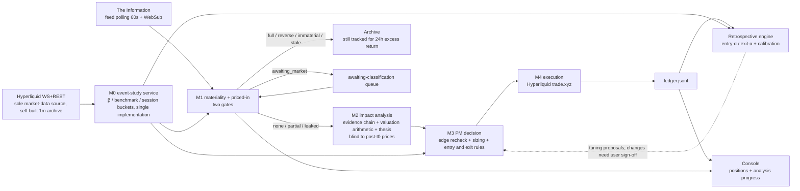

# Delta PM — US-Equity News-Driven Long/Short Trading System PRD

> Status: **v1.1, revised after user sign-off 2026-08-22, now in development** (short-horizon first). Remaining open items and user TODOs in §14.
> Last updated: 2026-08-22 · Chinese original (authoritative): `docs/us-stock-trading-prd.md` — per repo convention the Chinese version is the source of truth; this English copy must track it.
> Fact baseline: trade.xyz contracts and liquidity, and The Information feed behavior, all empirically measured 2026-08-22; the doc has passed a three-perspective adversarial review (35 findings absorbed) + three-track pre-development recon.

---

## 0. One-Page Summary

**What**: port predict-raven's proven forecasting capability (evidence chain → magnitude estimation → calibrated retrospectives) to US-equity long/short. News source = **The Information** (decided 2026-08-22); the system judges "has the market priced this in"; for unpriced news it estimates the impact path and fair magnitude, converts that into a long/short position, and executes on trade.xyz US-equity perpetuals on Hyperliquid. **V1 trades short-horizon event trades only**; long-horizon thesis trades are deferred to Phase 3.

**Core architecture = analyst → PM dual role**:

- **Analyst (M1+M2)**: takes news → judges materiality and priced-in status (M1) → impact path, evidence chain, valuation arithmetic, trade thesis (M2). M2's valuation is **blind to post-news price action** — otherwise "is it priced in" becomes circular.
- **PM (M3+M4)**: takes the thesis → whether to open, how big, how to exit (M3) → order placement and position management (M4). Short-horizon exits: valuation track / technical track / time track, plus the user-approved **−20% per-position hard stop** floor and **−25% portfolio kill switch**.

**Only two objectives get optimized: win rate and profit factor.** "Selling at the top" is not one of them.

**Strategy positioning**: don't race machines on simple headlines; earn the **slow digestion of complex news** — The Information is exactly the source with the highest scoop density and the highest share of purely narrative complex news (AI infra / big-tech insider reporting), a natural fit for this positioning. Latency is engineered at the minute scale.

**Three fundamental differences vs the prediction-market playbook**:

| | Prediction markets (existing) | US equities (this system) |
| --- | --- | --- |
| Settlement | Events have a hard settlement date and a binary outcome | No settlement; edge is realized through the price path, exit is an active decision |
| Market blindness | Forecast generation never reads market prices | **Only M2's valuation is blind to post-news price action**; M1 must read prices by design, M3/M4 watch prices throughout |
| Output | Probability (0–1) + Brier calibration | Direction + fair-magnitude range + time window + invalidation conditions; calibration via interval coverage and directional hit rate |

---

## 1. Background and Positioning

The repo already has three mature building blocks (reuse matrix, §11): raven-delta (news analysis + firstSeenUtc provenance + ingest seam), paper-agent (trading-loop skeleton + ledger + entry-α/exit-α retrospectives), forecast-engine (evidence-chain discipline). Gaps: a Hyperliquid execution adapter (zero code in repo), the M0 event-study service, and equity-native sizing and risk controls.

**News source decided (2026-08-22): The Information**; integration plan in §5 (public Atom feed polling as the trigger + newsletter-mailbox enhancement; logged-in scraping neither needed nor done).

**User methodology input (2026-08-22 conversation; design baseline)**:

1. Only two objectives: win rate, profit factor.
2. The agent fully owns entry/exit timing.
3. Two base logics for short-horizon selling: **valuation** (a big AI contract lands → raise next-year EPS → compute the fair upside %) and **the chart** (trim into weakness, sell the breakdown); don't chase the top.
4. Long-horizon follows the three-state thesis machine (realized and priced in → sell / falsified → stop out / hold hard) — **not implemented in V1**; short-horizon first.
5. Valuation is what forecasting can do — the analyst produces the thesis, the PM converts it to action.
6. **Primary risk rules (user-approved 2026-08-22): stop out any position down more than 20%; halt the portfolio at 25% total drawdown.**

## 2. Objectives and Trading Philosophy

- **Win rate**: share of closed trades that are profitable. **Profit factor** (gross profit ÷ gross loss): bucketed by short/long horizon (V1 has only the short bucket).
- Each gets an **anti-gaming diagnostic** (diagnose-only, never optimized; §10): expected return per unit of risk per unit of time; distribution of residual moves beyond the target zone.
- **Not optimized**: never chase the top; exit quality is measured by thesis capture rate, never by "distance from the high."
- **Narrowed action space**: `open / add / trim / close / flip / no-trade`, default no-trade. Expand only when retrospective data demands it.
- **One name, one position**: at most one net position per symbol; conflicts adjudicated by the PM; no two-sided hedged books.

## 3. Universe (21 names, finalized 2026-08-22; SPCX added by the user same day)

Selection principle: **follow the news source** — The Information's coverage spine is AI infrastructure, big tech, and semiconductors; the universe aligns to its scoop density (which is why the originally shortlisted crypto cluster COIN/HOOD/MSTR moved out of the main pool: its crypto coverage is not the mainline, and MSTR lacks growth-mode low fees). Liquidity data measured 2026-08-22:

| Group | Symbols | Measured highlights | tier |
| --- | --- | --- | --- |
| Mag 7 (7) | AAPL MSFT GOOGL AMZN NVDA META TSLA | 20x, cross-margin available (whole group); NVDA 24h $166M | 1 |
| Storage (3) | MU SNDK / WDC | MU/SNDK 10–20x cross, OI (open-interest notional) $140M+; WDC isolated-only, OI $2.5M, thin book | MU/SNDK=1; WDC=3 |
| Semis/supply chain (4) | AMD AVGO TSM ARM | 10x isolated-only; 24h $2–14M | 2 |
| AI infra/cloud (4) | ORCL INTC CRWV NBIS | **The Information's core coverage band**; NBIS 24h $44.6M, INTC $23.1M (deep volume); CRWV top-20 bid side only ~$22K (thin book — sizing must be book-aware) | INTC/NBIS=1; ORCL/CRWV=2 |
| Narrative/media (2) | PLTR NFLX | PLTR 24h $5.8M; NFLX $1.9M | PLTR=2; NFLX=3 |
| Pre-IPO (1) | **SPCX** (SpaceX) | **Added by user decision (2026-08-22)**; one of The Information's flagship beats; 10–20x, cross-capable | 2 (re-rate after launch measurements) |

Tier notes: tier-1 = 11 names (Mag7 + MU SNDK + INTC NBIS), tier-2 = 8 (incl. SPCX provisionally), tier-3 = 2 (WDC NFLX); tier caps per-symbol exposure (§9). Day-one snapshot tiering is noisy — re-rate periodically post-launch on multi-sample intraday averages; always read the live l2Book (per-level depth) and impactPxs before ordering.

**SPCX special handling** (pre-IPO perp; behaves differently from stock perps): no external equity oracle (the perp IS the price discovery), no earnings calendar, no splits/ex-dividend; M0 sets `benchmark = none` — priced-in classification uses the **raw price reaction** (still session-bucketed), no β residualization; fairImpact valuation runs "event → valuation delta ÷ last funding-round valuation" instead of the EPS chain. Verify the oracle configuration via `perpDexs` at launch.

**SKHY / KIOXIA / DRAM index: out of V1** — SKHX was the market involved in the 7/28 oracle incident (SKHY looks like a relisting; identity unconfirmed); Korea/Japan trading hours misalign with an English news source; and The Information covers HBM through the NVDA/MU lens anyway. Reserve pool (revisit in Phase 3): COIN HOOD MSTR RDDT NOW NET MRVL QCOM DELL AMAT CRWD + SKHY/KIOXIA/DRAM.

Universe config carries over raven-delta's operating model, with new fields: `hlSymbol`, `benchmark` (β benchmark, §11: XYZ100/SP500 across the board for now), `maxLeverageOnVenue`, `marginMode`, `liquidityTier`, `consensusBaseline` (consensus-baseline summary + timestamp; agent-refreshed post-earnings + biweekly; staleness >30 days gets a downgrade tag; NewsSignal must record which baseline version it cited).

## 4. Architecture and Data Flow

**M0 event-study service (shared library, built new)**: β estimation, benchmark series, excess returns, trading-session buckets (weekday RTH 13:30–20:00 UTC / weekday off-hours / weekend), trading calendar — the single implementation system-wide; M1, M3, and the retrospectives all call it; β and benchmark version numbers are written into archives (prevents the "same logic ×6" pathology from the repo complexity audit from recurring).

**Machine contracts** (zod-enforced): M1 → `NewsSignal` (fingerprint, firstSeenUtc + rationale, expectedDirection + coarse impact bucket, consensus-baseline version, materiality, six-state pricedIn + realized excess + volume z + data basis + t_eval−t0); M2 → `TradeThesis` (direction, fairImpactPct range, quantified impact-path chain, evidence + contamination grading, time window, catalysts, falsifiers, pricedInMarkers); M3 → `PMDecision` (action, entry zone, size, fully replayable stop-rule inputs, target zone, review schedule, cooldown state, clipping record + intended-vs-realized risk); M4 → ledger event family.

**Concurrency model (a substantive rework of paper-agent)**: M1/M2 analysis is stateless, parallel, and outside the writer queue (simultaneous gate-passers ordered by materiality, same-cluster items merged, concurrency capped at N); only M3 decision + M4 execution enter the single-writer queue, re-reading the portfolio snapshot on dequeue before clipping; inside the writer there are fast and slow lanes — the stop-loss/reconciliation lane can preempt.

**Trigger model**: event-driven (new feed entry → M1) + scheduled reviews (daily per open position) + fast tick (10 minutes: stop tightening, open-order management, venue trigger-order verification, liquidation-distance monitoring).

**Console (user requirement, 2026-08-22)**: shows current positions, what analysis is in flight, progress bars. Implementation blueprint in §15.

## 5. Module M1: Materiality + Priced-In Classification

### News ingestion (finalized 2026-08-22: The Information)

Measured findings (2026-08-22):

- **Trigger path = public Atom feed** (`theinformation.com/feed`, no auth): 60-second conditional GET polling (with ETag/If-Modified-Since; the CDN caches at s-maxage=60, so polling faster is pointless); in week one also attempt a WebSub subscription (the feed declares a Superfeedr hub — if the hub actually pushes, latency can drop below 10s; polling is the floor).
- **Fields**: stable entry id, published/updated (second-resolution UTC), title, author, body teaser, link. **t0 = published, never updated** (articles are updated in place and updated carries batch template noise); dedupe key = entry id.
- **Content volume**: briefing entries carry ~50 words in the feed ≈ near-full text (essentially all tradeable information is there); full articles ship only headline + lede (~100–250 words) — The Information's scoop convention front-loads the core facts into headline and lede, enough for M1/M2; occasionally a key number sits behind the paywall, logged as a limitation.
- **Primacy**: "Exclusive:"-prefixed entries (the majority) are internet-first at published, so t0 is trustworthy; **a "Reportedly" prefix = restating another outlet's reporting** — t0 must go through firstSeen online verification (~1–3 entries/day).
- **Volume**: weekdays ~8–15 entries (articles 4–9 + briefings 4–13), peak day 22; weekends 3–6. Thin flow but extremely high signal-to-noise; LLM cost stays manageable (every item runs through gate 1).
- **Backfill**: `sitemap-news.xml` (rolling 48h window, no auth) patches gaps at startup and after polling outages >1h (the feed window holds only 20 entries ≈ 1.5–2.5 days).
- **Getting full text (user confirmed 2026-08-22; four tiers)**: the compliance red line is that the ToS bans all automated scraping (logged-in included) — the feed and the mailbox are the only compliant automated seams — so full text is acquired in four tiers, degrading gracefully:
  1. **In the feed already**: briefings (most tradeable scoops) carry ~50 words ≈ near-full text; full articles ship headline + lede with the core facts front-loaded — most signals need nothing more;
  2. **Newsletter-parsing mailbox** (automated, hours of latency; context enrichment and next-day reconciliation, never a trigger): free The Briefing / The Information AM / The Weekend subscribe directly to the parsing mailbox; subscriber-only AI Agenda and Dealmaker get forwarded from the user's inbox;
  3. **Manual completion seam (console feature)**: when M1 rates a signal high-materiality but the key number sits behind the paywall, the signal card in the console shows a "paste full text" input — the user (a subscriber) opens the article, copies, pastes, and the system re-runs M2 with full text. Human reading + personal-use paste touches no automation red line; expected 0–2 times/day;
  4. **Official content licensing** (the durable fix): The Information's /corporate page explicitly offers content licensing; a sales conversation yields machine-readable full text — **on the user's batch-resolution list** (§14).

### Gate 1: does it matter — category first

Judged in order; failing any step archives the item: (1) event-category whitelist (earnings/guidance, orders and major customer contracts, M&A, product and technology milestones, regulation and litigation, management changes, supply-chain events, directly relevant macro; ratings and price targets alone don't clear the gate — corroboration only); (2) fact grade: fact > forecast > opinion; (3) subject relevance (the symbol is the story's protagonist); (4) surprise vs the consensus baseline (trade the surprise component, not the absolute number).

### Gate 2: is it priced in

**Layer 1 (is the news new)**: structural fingerprint (subject + category + order-of-magnitude hash) + text similarity vs the symbol's last 10 items; "old event, new fact" is its own class, scored on the increment; firstSeen provenance carries over raven-delta's mechanism.

**Layer 2 (has price already reacted)** — all computation goes through M0; data source = Hyperliquid perps (decided 2026-08-22, sole market-data source):

- **Excess return = perp return − β × index-perp return** (benchmark XYZ100/SP500, §11; both legs same venue and same session — internally consistent). Never use raw price change; plus a same-sector peer co-move check.
- **Leak-check window** [t0−5 trading days, t0): significant excess drift in expectedDirection → `leaked`; edge is docked by the portion already traveled.
- **Reaction completeness normalized by elapsed time**: realized excess at t_eval vs the event category's expected reaction-completion curve at Δt (simple headlines complete near-100% within minutes; complex transmission crosses 50% around 2h; cold-start uses coarse priors, calibrated on own data from Phase 0 on; NewsSignal must log Δt).
- **Volume confirmation**: volume z-score vs the historical baseline for the same minute-of-day and the **same session bucket** (RTH/off-hours/weekend). Caveat: this is perp volume, not the consolidated equity tape — different semantics; Phase 0 treats "the incremental value of volume z for classification" as an empirical calibration question, not a presumed win.
- **The 24/7 advantage and its cost**: HL perps quote around the clock (14 days of hourly bars with zero gaps, verified) — off-hours and weekend reactions stay observable, this design's unique edge over the Polygon option; the cost is thin off-hours volume (~5× thinner off-hours, ~17× weekends, 18% zero-volume minutes) → widen the classification band one notch and tag confidence degradation off-hours/weekends. Wholly unclassifiable periods go to the `awaiting_market` queue; **the latency budget starts at the first classifiable moment**.
- **Archived signals also get 24h excess tracking** (the confusion matrix's false-kill column).

**Output**: `pricedIn.status ∈ {none, partial, full, leaked, reverse, awaiting_market}`; `none/partial/leaked` proceed to M2; `reverse` is tag-only in V1.

**Latency budget** (from the first classifiable moment, total ≤15 minutes): gate 1 + fingerprint ≤2 min; firstSeen verification + M2 ≤10 min (report rendering cut, reasoning only); M3+M4 ≤2 min.

## 6. Module M2: Impact Analysis (Fundamental Quant Factors)

Discipline: **valuation is blind to post-t0 prices** (pre-news baselines allowed: market cap, forward P/E, consensus). Implementation = text-level price-reaction scrubbing (post-t0 price descriptions filtered/masked) + contamination grading (hard contamination vetoes / soft contamination downweights); **contamination rate is a mandatory Phase 0 metric**.

Valuation arithmetic (stepwise LLM; empirical support: Kim–Muhn–Nikolaev 2024): news → line-item deltas (with ranges) → next-year EPS revision % (vs consensus) → fair move % (multiple unchanged ≈ EPS revision %; re-rate the multiple only when the story changes) → one-off items via after-tax NPV ÷ market cap → output `fairImpactPct {min,max,point}` + per-source evidence.

Thesis construction: V1 is all `event_trade` (short-horizon); falsifiers are mandatory and testable; pricedInMarkers may only reference price-based and public-fact conditions (no consensus-revision data source, so citing sell-side behavior is banned).

## 7. Module M3: PM Decision

### 7.1 Entry

- **Edge recheck**: the live price at order time is recomputed through M0; `residualEdge = fairImpact − realized excess`.
- **Conservative yardstick**: compare against fairImpact's conservative end (long: min / short: max): `|conservative end − realized| ≥ max(round-trip cost × 3, 0.5 × daily vol)`.
- **Adverse-move guard**: realized excess since t0 opposing the thesis by more than 0.3 × daily vol → reclassify as `reverse` and send back; entering because "the edge got bigger" is forbidden.
- **Cost basis**: taker fee (0.009% growth-mode pool-wide, verified) + slippage budget (by tier + live book) + **signed funding** (shorts are often receivers), pro-rated over the holding period.
- **Event-calendar guard**: short-horizon positions default to not holding through the name's own earnings (unless the thesis is the earnings, explicit flag); at T−1 before a scheduled binary event, halve or close.
- **Cooldown**: after a stop-out, same symbol same direction banned for 72h.

### 7.2 Sizing

Fixed-risk method (quarter-Kelly dropped): `notional = equity × risk budget (default 1%, high-conviction 1.5%) ÷ stop distance %`; `effective leverage = min(3x, 1/(2 × max daily move))`. Risk clipping (§9) takes the min: clips downward only, logs the binding constraint, drops orders below the minimum; **intended vs realized risk is booked per trade**. Sizing for tier-2/3 names must be book-aware (read the top-20 l2Book levels and impactPxs; measured CRWV top-20 bid side only ~$22K). Worked examples in v1.0 (the three §7.2 worked examples' conclusions stand).

### 7.3 Exit (V1 = short-horizon)

Three triggers, first hit executes (the first two = the user's valuation/chart dual track, the third is a system guard):

| Track | Trigger | Notes |
| --- | --- | --- |
| Valuation | daily review recomputes residualEdge: enters the target zone (in excess-return terms) **or the edge turns negative** | harvest on realization; the "sell when net edge goes negative" rule carries over |
| Technical | breakdown: the harness's deterministic stop menu | initial stop = max(entry − 1.5×ATR(20-day), most recent pre-entry intraday swing low); trailing stop arms at 50% of the target zone (highest close − 2.5×ATR, ratchets up only); the LLM can only tighten; all inputs replayable |
| Time | t+horizon expiry: edge negative → close; still positive → forced review, one extension allowed | keeps a short-horizon trade from decaying into a trapped long-horizon hold |

**Hard floor (user-approved 2026-08-22): mark ≥20% against entry → unconditional close**, model-free, top priority, with a venue-side trigger order parked at this level (fires even if the process dies, §8). The technical stop menu usually sits far tighter than −20%; the hard floor is only a gap/extreme-tape backstop.

**Long-horizon three-state machine: not in V1** (2026-08-22 decision — short-horizon first). The design is preserved in v1.0 §7.3; before Phase 3 activation the user must sign off on the two remaining maintenance revisions (horizon-expiry re-evaluation / funding-drag review; the old "2× catastrophe stop" is absorbed by the −20% hard floor).

### 7.4 Portfolio layer

One name, one position; correlated-cluster caps (§9); for same-cluster news the PM expresses through the 1–2 names with the largest residualEdge; daily review = continuous valuation-track re-evaluation.

## 8. Module M4: Execution (Hyperliquid / trade.xyz)

**Contract and API facts** (measured 2026-08-22; the single maintained home for venue facts):

- Standard HL REST/WS; info calls carry `dex:"xyz"`; coin name `xyz:AAPL`; order asset id = 100000 + dexIndex×10000 + index. **WS verified working**: one connection subscribing candle(1m)/trades/bbo/l2Book all returns live data (the "xyz:COIN" naming just works); limits are 10 connections/IP, 1000 subscriptions, 2000 msg/min — 20 symbols × 3 channels = 60 subscriptions, huge headroom. REST cap 1200 weight/min; `metaAndAssetCtxs` (dex=xyz) is a single weight-20 call returning OI/volume/funding/mark/oracle for all 115 assets — 1/min polling suffices; **do not poll candleSnapshot per symbol** (~525/1200 weight, fragile).
- **Candle retention (hard constraint)**: only ~5000 bars per interval — 1m reaches back only ~3.6 days, 5m ~17.5 days, 15m ~52 days, 1h ~208 days, 4h/1d full history. ⇒ **The 1m archive must be self-built from day one** (WS to disk); volume baselines bootstrap on 5m/15m history and switch to 1m as the archive grows.
- 24/7 with zero gaps (14 days of hourly bars, verified); USDC margin; all 20 pool names have growth-mode enabled (taker 0.009% / maker 0.003%); median funding = 0.000625%/h baseline (~5.5% annualized), a few outliers (ORCL, SMH higher); weekend internal session: book-EMA oracle + Discovery Bounds (single names ±5–10%), Monday the oracle snaps back to the external price.
- Margin modes measured: cross available = Mag7 + MU + SNDK (+SP500/XYZ100); **the other 9 are all isolated-only** — portfolio design must not assume cross; isolated-margin consumption is a first-class constraint (§9).

**Execution policy**: maker-first limit orders + TTL fallback to market; exit orders reduce-only; orders carry a cloid for idempotency; on restart, reconcile in-flight orders first; every tick reconciles against `clearinghouseState`, and any mismatch alarms and halts. **Venue-side stop floor**: the moment each position opens, park a reduce-only trigger stop at the −20% hard-floor price (user-approved value); local scanning can only tighten it; reconciliation verifies the trigger order exists at the right price.

**Venue risk guards**:

1. **Oracle tail** (SKHX incident lesson): oracle diverges >2% from the external reference with no matching external move → freeze open/add/flip only, **stops and reductions always stay live**, stop triggers require 2 consecutive tick confirmations, alert the user immediately.
2. **Liquidation distance**: effective leverage per the §7.2 formula; margin headroom ≥ 2× max daily move, hard-checked.
3. **Weekend (2026-08-22 decision: open normally)**: the internal session opens and exits as usual, no restrictions; retained system-side: sizing stress-checks margin for weekend-held positions under a "Monday gap fills at 2× stop distance" scenario (weekend stop fills are suppressed by Discovery Bounds while Monday snaps back to the true price, so the risk arithmetic uses the gap price); the oracle guard runs on weekends via the 2-tick confirmation plus bounds-edge awareness.
4. **Corporate actions**: split policy unpublished — a split announcement on a pool name suspends it until confirmed (NFLX already quotes post-split; verify series continuity before its history enters M0); dividends are not paid to perp holders, ex-div dates go on the event calendar, live-test the venue's behavior once before Phase 2.
5. **Delisting risk**: 14 markets measured isDelisted; if a held name announces delisting, exit immediately and orderly per liquidity.
6. **Compliance**: user confirmed access is compliant (2026-08-22).

**Keys and accounts**: HL agent/API-wallet model (trading rights split from withdrawal rights; the master key never touches the VM); **Phase 0 shadow mode runs zero-credential** (public info API only); credentials to be provided by the user later (confirmed 2026-08-22); complete testnet verification of the full action family before Phase 2.

## 9. Risk Controls

`DELTAPM_*` env namespace; **the two primary rules are user-approved values, the rest are defaults** (any change requires user confirmation — the agent must not alter them unilaterally); enforced by execution-layer clipping:

| Parameter | Value | Source |
| --- | --- | --- |
| **Per-position hard stop** | **mark ≥20% against entry → unconditional close** (venue-side trigger order as backstop) | **User-approved 2026-08-22** |
| **Portfolio kill switch** | **equity ≤ initial capital × 75% (25% total drawdown) → halt all new risk**; stops/reductions/reconciliation/trigger-order upkeep continue; restart requires user unlock | **User-approved 2026-08-22** (replaces the old HWM 15% row) |
| Per-trade risk budget | 1% (high-conviction 1.5%) | default |
| Per-symbol notional | tier-1 ≤30% / tier-2 ≤15% / tier-3 ≤5% equity | default |
| Portfolio gross / net | ≤150% / ≤100% equity | default |
| Correlated cluster | per-cluster gross ≤40% (cluster = universe tags) | default |
| Isolated-margin usage | total isolated-position margin ≤50% equity | default (9/20 names isolated-only) |
| Effective leverage | min(3x, 1/(2×max daily move)) | default |
| Daily-loss switch | day's loss ≥3% equity → no new opens (stops keep running) | default |
| Event calendar | no holding through own earnings; T−1 halve; ex-div flag | default |
| Cooldown | 72h same-symbol same-direction after a stop-out | default |
| Minimum order | $50 notional | default |

Clipping reuses the `applyTradeGuardsDetailed` architecture + new free-collateral / margin-buffer constraints. The kill switch fails closed.

## 10. Retrospectives and Metrics

Entry-α / exit-α decomposed on episode semantics (reflect.ts semantics; the counterfactual horizon is fixed at signal time, immutable). Entry retros: signal validity (24h/horizon excess direction, including the archived-signal false-kill column), edge decay, fairImpact interval coverage (target ~70%) + contamination rate. Exit retros: attributed across the three tracks (post-target residual moves are calibration and anti-gaming monitoring only; the share that keeps falling after a breakdown validates the stop menu; time-track extension stats). **Two accounting bases run in parallel, explicitly unreconciled**: decisions/calibration use excess returns, execution/stops use raw prices; the dashboard shows raw PnL and β-hedged PnL side by side. Archives at `runtime-artifacts/delta-pm/{signals/, theses/<id>/, portfolio.json, ledger.jsonl, reports/}`; daily reflection reuses the reflect skeleton.

## 11. Reuse Matrix and Market Data

Reuse matrix unchanged (v1.0 §11): paper-agent ledger / strategy pure functions / stop-loss priority (scheduling reworked into the two-layer concurrency model), raven-delta ingest/provenance/universe, forecast-engine evidence chain (blindness redone as text scrubbing), risk-clipping architecture; built new = HL adapter, M0, gate 2, the M3 strategy layer, the event calendar.

**Market data (decided 2026-08-22: Hyperliquid API as the sole source, zero external spend)**, four design mandates:

1. **Ingestion**: one WS connection subscribing candle(1m)/trades/bbo for the 20 symbols + benchmarks; REST only for 1/min `metaAndAssetCtxs` + pre-order l2Book.
2. **Archive from day one**: the 1m candle API reaches back only 3.6 days → the WS-to-disk self-built archive is Phase 0's first deliverable; volume baselines bootstrap on 5m (17.5d) / 15m (52d).
3. **β benchmark**: XYZ100 (313 daily bars) / SP500 (157); **SMH/SOXL/MAGS banned for now** (68/16/4 daily bars; SMH daily volume just $343K); β from RTH-aligned daily or 1h (208 days) return regressions, avoiding weekend-bar contamination; recent listings like NBIS (74 bars) have short β samples — tag confidence degradation.
4. **Session buckets**: all volume/volatility baselines maintained separately across {weekday RTH, weekday off-hours, weekend} (measured 5× thinner off-hours, 17× weekends).

Known costs (accepted; calibrated in Phase 0): perp volume is not the consolidated tape, funding basis, measured mark-vs-oracle deviation ≤6bp, weekend bounds suppression. In exchange, the unique upside: 24/7 observable reactions + zero data cost + market data and execution from the same source with no alignment error.

## 12. Non-Goals

No news-source diversification (V1 is single-source The Information; thin flow is the accepted positioning), no racing simple headlines, no options / multi-venue / market-making / crypto pairs, no public product, no auto-tuned risk parameters, no fades or β-hedged books in V1, **no long-horizon thesis trades in V1**, no logged-in content scraping.

## 13. Phased Plan

Threshold numbers are review reference lines (honest sample-size disclosure in v1.0 §13); promotions require user sign-off:

| Phase | Scope | Promotion review reference |
| --- | --- | --- |
| **Phase 0 shadow** (4–6 weeks, **zero credentials, zero spend**) | feed poller + WS archive + M0/M1/M2 at full speed, M3 paper decisions with no orders; console live; daily reports | ≥60 signals tracked; M1 directional hit rate + CI; coverage ≥60%; contamination rate measured; reaction-curve v1; zero silent pipeline failures |
| **Phase 1 paper trading** (4–6 weeks) | M4 simulates fills against the l2Book (book-sim); full ledger + retros; dual-basis dashboard | short bucket n≥30: win rate ≥50% and PF ≥1.3 (with CI); full drills of risk controls / reconciliation / cooldown / trigger orders |
| **Phase 2 small real money** | separate wallet, $2k–5k; **prereqs: user provides HL API credentials + testnet full-action-family verification** | 6–8 weeks of metrics no worse than paper (within −5pp/−0.2, n≥15); zero risk-control incidents; one ex-div day observed live |
| **Phase 3 scale-up** | long-horizon thesis trades (settle the remaining maintenance revisions first), fades, β hedging, pool expansion (SKHY/KIOXIA/DRAM revisited), consensus data source | item-by-item sign-off |

## 14. Decision Log and TODOs

**Decided (2026-08-22, user)**: news source = The Information; market data = Hyperliquid API as sole source (no Polygon purchase); primary risk rules = −20% per-position stop + −25% portfolio halt; weekends open normally; short-horizon first; compliance confirmed; deploy on the Tokyo VM; HL API credentials to follow; **SPCX added to the universe (21 names)**; **subscription + newsletter-mailbox plan confirmed ("做呗")**; develop to completion, blockers collected for the user to batch-resolve.

**Decided by the agent and disclosed here (2026-08-22; reversible)**: universe tiers (§3; crypto cluster out, SKHY/KIOXIA/DRAM out of V1); The Information ingestion architecture (feed polling + WebSub attempt + four-tier full text, §5); benchmarks XYZ100/SP500 over SMH (data too young, §11); console and scaffolding shape (§15).

**User batch-resolution list (development does not wait on these; new blockers get appended here as they surface)**:

1. **The Information subscription setup**: paid subscription (single named subscriber; the ToS bans sharing); free newsletters (The Briefing / The Information AM / The Weekend) subscribed to the parsing mailbox; forward AI Agenda and Dealmaker from the user's inbox. The parsing-mailbox endpoint (inbound address / IMAP) gets configured once the dev side ships concrete hookup instructions;
2. **Official content-licensing outreach** (the /corporate form) — the durable machine-readable-full-text fix; disclose the LLM-processing use case there too;
3. **HL API credentials (agent wallet)** — before Phase 2 real money;
4. **Tokyo VM deployment confirmation** — VM disk at 81% (builder-cache cleanup pending user confirmation, see the 7/20 handoff entry); clean up before deploying the two delta-pm containers;
5. **Ruling on the three long-horizon maintenance revisions** — before Phase 3 enables long-horizon trades.

## 15. Development Blueprint (v1, set by the 2026-08-22 recon)

- **Service** `services/delta-pm` (@autopoly/delta-pm): structural clone of paper-agent (tsx + zod, flat src/, store.ts atomic writes/locks/ledger nearly verbatim), embedding a raw node:http read-only status server on **:8792** (/healthz /status /snapshot /ingest); concurrency per §4's two-layer model.
- **Contracts** `packages/delta-pm-contracts`: zod (unified on 3.x) definitions of NewsSignal/TradeThesis/PMDecision/ledger events; vitest alias added to config/vitest.config.ts.
- **HL client**: hand-written `src/hyperliquid.ts` (modeled on polymarket.ts: read-only, timeout + one retry + zod validation, structurally incapable of placing orders — Phase 0); the SDK decision (@nktkas/hyperliquid vs a Python sidecar) is deferred to Phase 1/2 when signing arrives, and goes through user confirmation as a new dependency.
- **Console** `apps/delta-pm-console` (**:3400**, new Next app; raven-delta untouched): positions view follows the live-predict-raven pattern (server-side fetch of :8792, tolerant decoding, TTL + baked-in fallback); the "analyzing + progress bar" view copies and adapts apps/raven/components/research/{plan,progress-dock,use-reveal,shimmer} + buildPlanSteps (stripping the i18n coupling); transport = 1.6–3s polling (a repo-proven pattern; delta-ws push is an optional enhancement, not the main channel — WS is not proxied through the domain).
- **Tests**: no per-workspace vitest (raven-delta's ERR_REQUIRE_ESM trap); the root `pnpm test` glob takes over.
- **Deployment**: deploy/raven compose adds two containers (raven-suite image, 127.0.0.1:8792/:3400); the Dockerfile adds a console build line; verify VM memory headroom before deploying.

---

*v1.0 (full risk-control worked examples, the long-horizon three-state machine design, the original open questions) lives in git history; research and recon notes are archived with PR #103.*
