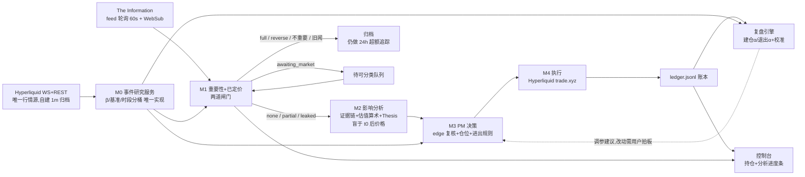

# Delta PM — 美股新闻驱动多空交易系统 PRD

> 状态:**v1.1,2026-08-22 用户拍板后修订,进入开发**(先短线)。剩余待决项与用户待办见 §14。
> 最后更新:2026-08-22 · 英文版:`docs/en/us-stock-trading-prd.md`
> 事实基线:trade.xyz 合约与流动性、The Information feed 行为均为 2026-08-22 实测;已过三视角对抗评审(35 条发现吸收)+ 三路开发前 recon。

---

## 0. 一页摘要

**做什么**:把 predict-raven 已验证的 forecasting 能力(证据链 → 幅度判断 → 校准复盘)迁移到美股多空。新闻源 = **The Information**(2026-08-22 拍板);系统判断"市场是否已定价";未定价的,估出影响路径与合理幅度,转成多空仓位,在 Hyperliquid 上 trade.xyz 的美股永续合约执行。**V1 只做短线事件单**,长线 thesis 单推迟到 Phase 3。

**核心架构 = analyst → PM 双角色**:

- **Analyst(M1+M2)**:接新闻 → 判重要性与是否已定价(M1)→ 影响路径、证据链、估值算术、交易 thesis(M2)。M2 估值**盲于新闻后的价格反应**,否则"是否已定价"是循环论证。
- **PM(M3+M4)**:接 thesis → 开不开、开多大、怎么退(M3)→ 下单与仓位管理(M4)。短线退出:估值轨 / 技术轨 / 时间轨,外加用户拍板的 **单仓 −20% 硬止损**地板与 **组合 −25% 停机**。

**只优化两个目标:胜率、盈亏比。** 不优化"卖在最高点"。

**策略定位**:不和机器抢简单头条,赚**复杂新闻的慢消化**——The Information 正好是 scoop 密度最高、纯叙事复杂新闻占比最高的源(AI infra/大厂内幕),与这个定位天然匹配。延迟按分钟级设计。

**与预测市场做法的三个根本差异**:

| | 预测市场(现有) | 美股(本系统) |
| --- | --- | --- |
| 结算 | 事件有明确结算日与二元结果 | 无结算;edge 靠价格路径实现,退出是主动决策 |
| 市场盲测 | 预测生成全程禁读市场价 | **只有 M2 估值盲于新闻后的价格反应**;M1 恰恰要读价格,M3/M4 全程看价 |
| 输出 | 概率(0–1)+ Brier 校准 | 方向 + 合理幅度区间 + 时间窗 + 失效条件;校准用区间覆盖率与方向命中率 |

---

## 1. 背景与定位

repo 已有三块成熟积木(复用矩阵 §11):raven-delta(新闻分析 + firstSeenUtc 溯源 + ingest 接缝)、paper-agent(交易循环骨架 + 账本 + 建仓α/退出α复盘)、forecast-engine(证据链纪律)。缺口:Hyperliquid 执行适配器(repo 零代码)、M0 事件研究服务、股票原生 sizing 与风控。

**新闻源已定(2026-08-22):The Information**,接入方案见 §5(公开 Atom feed 轮询触发 + newsletter 邮箱增强,无需也不做登录态抓取)。

**用户方法论输入(2026-08-22 对话,设计基准)**:

1. 只优化两个目标:胜率、盈亏比。
2. Agent 完全负责买卖点判断。
3. 短线卖出两条基础逻辑:**估值**(签大 AI 单 → 上调明年 EPS → 算出合理涨幅 %)与**看图**(跌下来减一点、破位就卖);不追求卖在最高点。
4. 长线看 thesis 三态(兑现且 price-in→卖 / 证伪→止损 / 硬拿)——**V1 不实现**,先做短线。
5. 估值是 forecasting 能做的——analyst 产 thesis,PM 转动作。
6. **风控主规则(2026-08-22 拍板):单个仓位下跌超过 20% 止损;整体亏损超过 25% 停止 portfolio。**

## 2. 优化目标与交易哲学

- **胜率**:已平仓 trade 中盈利笔数占比。**盈亏比**(profit factor,总盈利 ÷ 总亏损):按短线/长线分桶统计(V1 只有短线桶)。
- 各配一个**防作弊诊断**(只诊断不优化,§10):单位风险单位时间期望收益;目标区外残余走势分布。
- **不做的优化**:不追求卖在最高点;退出质量用 thesis 捕获率衡量,永不用"距最高点"。
- **动作空间收窄**:`open / add / trim / close / flip / no-trade`,默认 no-trade。复盘数据说明需要时再扩。
- **一票一仓**:同标的最多一个净头寸,冲突由 PM 裁决,不做双向对冲持仓。

## 3. 标的池(20 只,2026-08-22 定版)

选池原则:**跟着新闻源走**——The Information 的报道主线是 AI 基础设施、大厂、半导体,标的池向它的 scoop 密度对齐(为此把原备选的加密簇 COIN/HOOD/MSTR 移出主池:其加密报道非主线,且 MSTR 无 growth-mode 低费率)。流动性数据 2026-08-22 实测:

| 组 | 标的 | 实测要点 | tier |
| --- | --- | --- | --- |
| Mag 7(7) | AAPL MSFT GOOGL AMZN NVDA META TSLA | 20x、可 cross(全仓);NVDA 24h $166M | 1 |
| 存储(3) | MU SNDK / WDC | MU/SNDK 10–20x cross、OI(未平仓名义)$140M+;WDC isolated(逐仓)、OI $2.5M、盘口薄 | MU/SNDK=1;WDC=3 |
| 半导体/供应链(4) | AMD AVGO TSM ARM | 10x isolated-only;24h $2–14M | 2 |
| AI infra/云(4) | ORCL INTC CRWV NBIS | **The Information 核心报道带**;NBIS 24h $44.6M、INTC $23.1M(量深);CRWV 前 20 档买侧仅 ~$22K(盘口薄,sizing 须 book-aware) | INTC/NBIS=1;ORCL/CRWV=2 |
| 叙事/媒体(2) | PLTR NFLX | PLTR 24h $5.8M;NFLX $1.9M | PLTR=2;NFLX=3 |

tier 说明:tier-1 = 11 只(Mag7 + MU SNDK + INTC NBIS),tier-2 = 7 只,tier-3 = 2 只(WDC NFLX);tier 决定单标的敞口上限(§9)。首日快照定档有噪音,上线后按当日多次采样均值定期重估;下单前一律读实时 l2Book(逐档盘口)与 impactPxs。

**SKHY / KIOXIA / DRAM 指数:不入 V1**——SKHX 是 7/28 oracle 事故涉事市场(SKHY 为疑似重开盘,正主未确认);韩日行情时段与英文新闻源错位;The Information 报 HBM 也是从 NVDA/MU 视角。备选池(Phase 3 再议):COIN HOOD MSTR RDDT NOW NET MRVL QCOM DELL AMAT CRWD + SKHY/KIOXIA/DRAM。

universe 配置沿用 raven-delta 运营模式,新增字段:`hlSymbol`、`benchmark`(β 基准,见 §11:现阶段一律 XYZ100/SP500)、`maxLeverageOnVenue`、`marginMode`、`liquidityTier`、`consensusBaseline`(共识基线摘要 + 时间戳,agent 财报后 + 双周刷新;过期 >30 天降级标注,NewsSignal 必须记录引用的基线版本)。

## 4. 系统架构与数据流

**M0 事件研究服务(共享库,全新构建)**:β 估计、基准序列、超额收益、交易时段分桶(工作日 RTH 13:30–20:00 UTC / 工作日盘外 / 周末)、交易日历——全系统唯一实现,M1/M3/复盘三处全调它,β 与基准版本号写进归档(防 repo 复杂度审计里"同一逻辑 ×6"的病灶复发)。

**机器契约**(zod 强制):M1 → `NewsSignal`(指纹、firstSeenUtc + 依据、expectedDirection + 粗估影响档、共识基线版本、materiality、pricedIn 六态 + 已实现超额 + 量能 z + 数据依据 + t_eval−t0);M2 → `TradeThesis`(方向、fairImpactPct 区间、影响路径量化链、证据 + 污染分级、时间窗、催化剂、falsifiers、pricedInMarkers);M3 → `PMDecision`(动作、入场区、size、止损规则全输入可回放、目标区、复审计划、冷却状态、裁剪记录 + 意图 vs 实现风险);M4 → 账本事件族。

**并发模型(对 paper-agent 的实质改造)**:M1/M2 分析无状态、并行、不进写者队列(同时过闸按 materiality 排序、同簇合并、并发上限 N);仅 M3 决策 + M4 执行进单写者队列,入队先重读组合快照再裁剪;写者内快慢两道,止损/对账 lane 可插队。

**触发模型**:事件驱动(feed 新条目即 M1)+ 定时复审(在持仓每日 1 次)+ 快 tick(10 分钟:止损收紧、挂单管理、场地触发单核对、强平距离监控)。

**控制台(2026-08-22 用户要求)**:能看到当前持仓、正在进行什么分析、进度条。实现蓝图见 §15。

## 5. 模块 M1:重要性 + 已定价判断

### 新闻接入(2026-08-22 定版:The Information)

实测结论(2026-08-22):

- **触发路径 = 公开 Atom feed**(`theinformation.com/feed`,无需鉴权):60 秒条件 GET 轮询(带 ETag/If-Modified-Since,CDN 缓存 s-maxage=60,再快无意义);同时第一周尝试 WebSub 订阅(feed 声明了 Superfeedr hub,若 hub 真推送可到 <10s 延迟,轮询保底)。
- **字段**:稳定条目 id、published/updated(秒级 UTC)、标题、作者、正文 teaser、链接。**t0 = published,绝不用 updated**(文章会原地更新,updated 有批量模板噪音);去重键 = 条目 id。
- **内容量**:briefing 条目 feed 里 ~50 词 ≈ 近全文(可交易信息基本都在);长文只有标题 + 导语(~100–250 词)——The Information 的 scoop 惯例是把核心信息前置到标题与导语,够 M1/M2 用;偶有关键数字在墙内,作为 limitation 记录。
- **首发性**:"Exclusive:" 前缀条目(多数)published 即全网首发,t0 可信;**"Reportedly" 前缀 = 转述他家报道**,t0 必须走 firstSeen 联网核实(约 1–3 条/天)。
- **量级**:工作日 ~8–15 条(文章 4–9 + briefing 4–13),峰值日 22 条;周末 3–6 条。量薄但信噪比极高,LLM 成本可控(全量过闸门 1)。
- **回填**:`sitemap-news.xml`(滚动 48h 窗,无需鉴权)在启动时与轮询中断 >1h 后补漏(feed 窗口只有 20 条 ≈ 1.5–2.5 天)。
- **增强路径(延迟数小时,只做上下文补充与次日对账,绝不做触发)**:newsletter 解析邮箱——免费的 The Briefing / The Information AM / The Weekend 直接订阅到解析邮箱;订阅者专属的 AI Agenda、Dealmaker 由用户从自己邮箱设转发。**用户待办**见 §14。
- **合规红线**:ToS 禁止任何自动化抓取(含登录态);feed 与邮箱是仅有的合规机器接缝,**不做登录态文章正文抓取**;若日后需要授权全文,走其 /corporate 内容授权通道。

### 闸门 1:重要吗——类别优先

按序判定,任一不过即归档:① 事件类别白名单(财报/指引、订单与大客户合同、并购、产品与技术节点、监管与诉讼、管理层变动、供应链事件、直接相关宏观;评级与目标价单独不过闸只作佐证);② 事实等级 fact > forecast > opinion;③ 主体相关性(标的是新闻主角);④ surprise vs 共识基线(打超预期部分,不打绝对数字)。

### 闸门 2:已定价了吗

**第一层(新闻是否新)**:结构指纹(主体+类别+数量级 hash)+ 文本相似度 vs 该标的近 10 条;"旧事件、新事实"单独成类按增量打分;firstSeen 溯源沿用 raven-delta 机制。

**第二层(价格是否已反应)**——全部计算走 M0,数据源 = Hyperliquid 永续(2026-08-22 拍板,唯一行情源):

- **超额收益 = perp 收益 − β × 指数 perp 收益**(基准 XYZ100/SP500,见 §11;两边同场地同时段,口径自洽)。永不用裸涨跌,另加同板块 peer 同向检查。
- **泄露检查窗** [t0−5 交易日, t0):expectedDirection 方向显著超额漂移 → `leaked`,edge 扣除已走部分。
- **反应完成度按已流逝时间归一**:t_eval 时刻已实现超额 vs 该事件类别在 Δt 处的预期反应完成率曲线(简单头条分钟内近 100%,复杂传导 2h 过半;冷启动用粗先验,Phase 0 起自家数据校准,NewsSignal 强制记 Δt)。
- **量能确认**:同一分钟时段、**同时段桶**(RTH/盘外/周末)历史基线的量能 z 值。注意:这是 perp 成交量不是股票合并成交量,语义不同——Phase 0 把"量能 z 对判定的增益"当校准问题实测,不预设有效。
- **24/7 优势与代价**:HL 永续全天候有价(14 天小时线零缺口实测),盘外/周末也能观察反应——这是本方案对 Polygon 方案的独特优势;代价是盘外量薄(盘外 ~5×、周末 ~17× 稀薄,18% 零成交分钟)→ 盘外/周末的判定带宽放宽一档并标注置信度降级。完全不可判时段进 `awaiting_market` 队列,**延迟预算从首个可分类时刻起算**。
- **归档信号也做 24h 超额追踪**(混淆矩阵的"错杀"列)。

**输出**:`pricedIn.status ∈ {none, partial, full, leaked, reverse, awaiting_market}`;`none/partial/leaked` 进 M2;`reverse` V1 只标注。

**延迟预算**(从首个可分类时刻,总 ≤15 分钟):闸门 1+指纹 ≤2 分钟;firstSeen 核实 + M2 ≤10 分钟(砍报告渲染,只留推理);M3+M4 ≤2 分钟。

## 6. 模块 M2:影响分析(基本面量化因子)

纪律:**估值盲于 t0 之后的价格**(可看新闻前基线:市值、forward P/E、共识)。实现 = 文本级价格反应清洗(t0 后价格描述滤除/遮蔽)+ 污染分级(硬污染否决 / 软污染降权),**污染率是 Phase 0 必测指标**。

估值算术(LLM 分步,Kim–Muhn–Nikolaev 2024 实证支撑):新闻 → 科目增量(带区间)→ 明年 EPS 修正 %(相对共识)→ 合理变动 %(倍数不变 ≈ EPS 修正 %;认知改变才动倍数)→ 一次性事项走 税后净现值 ÷ 市值 → 输出 `fairImpactPct {min,max,point}` + 逐源证据。

Thesis 构造:V1 全部为 `event_trade`(短线);falsifiers 必填可检验;pricedInMarkers 只允许价格类与公开事实类条件(无共识修正数据源,禁止引用卖方行为)。

## 7. 模块 M3:PM 决策

### 7.1 入场

- **Edge 复核**:下单时刻实时价经 M0 重算,`residualEdge = fairImpact − 已实现超额`。
- **保守口径**:比对 fairImpact 保守端(做多 min / 做空 max):`|保守端 − 已实现| ≥ max(往返成本 × 3, 0.5 × 日波动)`。
- **逆势守卫**:t0 以来已实现超额与 thesis 反向超 0.3 × 日波动 → 改判 `reverse` 回炉,不得按"edge 变大"进场。
- **成本口径**:taker 费(全池 growth-mode 0.009%,实测确认)+ 滑点预算(按 tier + 实时盘口)+ **带符号 funding**(空头常为收方)按持有期折算。
- **事件日历守卫**:短线仓默认不持过自家财报(thesis 即财报除外,显式 flag);临近计划内二元事件 T−1 减半或平。
- **冷却期**:同标的止损后 72h 禁同方向重进。

### 7.2 Sizing

固定风险法(弃 quarter-Kelly):`名义 = equity × 风险预算(默认 1%,高置信 1.5%)÷ 止损距离%`;`实际杠杆 = min(3x, 1/(2×单日最大波动))`。经风控裁剪(§9)取 min:只向下裁、记 binding constraint、低于最小单弃单,**意图 vs 实现风险逐笔入账**。tier-2/3 标的 sizing 必须 book-aware(读 l2Book 前 20 档与 impactPxs;实测 CRWV 前 20 档买侧仅 ~$22K)。算例见 v1.0(§7.2 三笔算例结论不变)。

### 7.3 退出(V1 = 短线)

三条触发,先到先执行(前两条 = 用户的"估值/看图"双轨,第三条为系统守卫):

| 轨 | 触发 | 说明 |
| --- | --- | --- |
| 估值轨 | 每日复审重算 residualEdge:进目标区(超额口径)**或 edge 转负** | 兑现即收割;"净 edge 为负就卖"延续 |
| 技术轨 | 破位:harness 确定性止损菜单 | 初始止损 = max(入场 − 1.5×ATR(20 日), 入场前最近盘中摆动低点);到目标区 50% 后启动移动止损(最高收盘 − 2.5×ATR,只升不降);LLM 只能收紧;全输入可回放 |
| 时间轨 | t+horizon 到期:edge 转负 → 平;仍正 → 强制复审,可展期一次 | 防短线单变被套长线单 |

**硬地板(2026-08-22 用户拍板):mark 对入场价反向 ≥20% → 无条件平仓**,model-free、优先级最高、场地侧触发单挂在此价位(进程宕机也能触发,见 §8)。技术止损菜单通常远比 −20% 紧,硬地板只在跳空/极端行情兜底。

**长线三态机:V1 不实现**(2026-08-22 拍板先做短线)。设计保留于 v1.0 §7.3,Phase 3 启用前需用户拍板其余两条维护性修订(horizon 到期重估 / funding 拖累复审;原"2× 灾难止损"已被 −20% 硬地板吸收)。

### 7.4 组合层

一票一仓;相关簇上限(§9);同簇新闻 PM 挑 residualEdge 最大的 1–2 只表达;每日复审 = 估值轨持续重估。

## 8. 模块 M4:执行(Hyperliquid / trade.xyz)

**合约与 API 事实**(2026-08-22 实测;场地事实唯一维护处):

- 标准 HL REST/WS;info 带 `dex:"xyz"`;币名 `xyz:AAPL`;下单 asset id = 100000 + dexIndex×10000 + index。**WS 实测可用**:单连接订阅 candle(1m)/trades/bbo/l2Book 全部返回实时数据("xyz:COIN" 命名直接生效);限额 10 连接/IP、1000 订阅、2000 msg/min——20 标的 × 3 频道 = 60 订阅,余量巨大。REST 限额 1200 权重/分钟;`metaAndAssetCtxs`(dex=xyz)一次 weight-20 调用返回全部 115 资产的 OI/量/funding/mark/oracle,1 次/分钟轮询即可;**不要按标的轮询 candleSnapshot**(~525/1200 权重,脆弱)。
- **K 线保留深度(硬约束)**:每 interval 只留 ~5000 根——1m 仅回溯 ~3.6 天、5m ~17.5 天、15m ~52 天、1h ~208 天、4h/1d 全史。⇒ **1m 归档必须从 day-one 自建**(WS 落盘),量能基线先用 5m/15m 史 bootstrap,随归档增长换 1m。
- 24/7 无缺口(14 天小时线实测);USDC 保证金;全池 20 只 growth-mode 全开(taker 0.009%/maker 0.003%);funding 中位数 = 基线 0.000625%/时(~5.5% 年化),个别偏离(ORCL、SMH 更高);周末 internal session:盘口 EMA oracle + Discovery Bounds(个股 ±5–10%),周一 oracle 跳回外部价。
- 保证金模式实测:cross 可用 = Mag7 + MU + SNDK(+SP500/XYZ100);**其余 9 只全部 isolated-only**——组合设计不得假设 cross,隔离保证金占用是一等约束(§9)。

**执行策略**:maker-first 限价 + TTL 转市价;退出单 reduce-only;订单带 cloid 幂等;重启先对账在途订单;每 tick 与 `clearinghouseState` 对账,不一致告警停机。**场地侧止损地板**:每仓建立即挂 reduce-only 触发止损单于 −20% 硬地板价(用户拍板值);本地扫描只收紧;对账核对触发单在且价位对。

**场地风险守卫**:

1. **Oracle 尾部**(SKHX 事故教训):oracle 与外部参照背离 >2% 且外部无对应变动 → 只冻结 open/add/flip,**止损与减仓永续在线**,止损触发需连续 2 个 tick 确认,即时告警用户。
2. **强平距离**:实际杠杆按 §7.2 公式;保证金余量 ≥ 单日最大波动 ×2 硬校验。
3. **周末(2026-08-22 拍板:正常开仓)**:internal session 照常开仓与退出,不做限制;系统侧保留:sizing 对过周末仓位按"周一跳空 2× 止损距离成交"情景校验保证金(周末止损成交价被 Discovery Bounds 压制、周一跳回真实价,风险算术按跳空价);oracle 守卫在周末靠 2-tick 确认与 bounds 边界感知运作。
4. **公司行为**:拆股政策未公布——池内拆股公告即暂停该标的至确认(NFLX 已是拆股后价格,历史序列进 M0 前先验证连续性);分红不付 perp 持有人,除权日进事件日历,Phase 2 前实测一次场地行为。
5. **下架风险**:实测 14 市场已 isDelisted;在持标的若公告下架,按流动性立即有序退出。
6. **合规**:用户确认接入合规(2026-08-22)。

**密钥与账户**:HL agent/API wallet 模式(交易权与提币权分离,主钥永不上 VM);**Phase 0 影子模式零凭证**(只用公开 info API);凭证由用户后续提供(2026-08-22 确认),Phase 2 前完成 testnet 全动作族验证。

## 9. 风控

`DELTAPM_*` env 命名空间;**两条主规则为用户拍板值,其余为默认值**(改动均需用户确认,agent 不得擅自改);执行层裁剪:

| 参数 | 值 | 来源 |
| --- | --- | --- |
| **单仓硬止损** | **mark 对入场价反向 ≥20% → 无条件平**(场地侧触发单托底) | **用户拍板 2026-08-22** |
| **组合停机** | **equity ≤ 初始资金 × 75%(整体亏损 25%)→ 停一切新增风险**;止损/减仓/对账/触发单维护照常;恢复需用户解锁 | **用户拍板 2026-08-22**(替代原 HWM 15% 行) |
| 单笔风险预算 | 1%(高置信 1.5%) | 默认 |
| 单标的名义 | tier-1 ≤30% / tier-2 ≤15% / tier-3 ≤5% equity | 默认 |
| 组合 gross / net | ≤150% / ≤100% equity | 默认 |
| 相关簇 | 单簇 gross ≤40%(簇 = universe tags) | 默认 |
| 隔离保证金占用 | isolated 仓保证金合计 ≤50% equity | 默认(9/20 标的 isolated-only) |
| 实际杠杆 | min(3x, 1/(2×单日最大波动)) | 默认 |
| 日亏损开关 | 当日亏损 ≥3% equity → 停新开(止损照跑) | 默认 |
| 事件日历 | 不持过自家财报;T−1 减半;除权日 flag | 默认 |
| 冷却期 | 止损后同标的同方向 72h | 默认 |
| 最小单 | $50 名义 | 默认 |

裁剪复用 `applyTradeGuardsDetailed` 架构 + 新增 free-collateral / margin-buffer 约束。停机 fail-closed。

## 10. 复盘与指标

建仓α / 退出α 按 episode 口径拆解(reflect.ts 语义;counterfactual horizon 信号时刻定死不可变)。建仓复盘:信号真伪(24h/horizon 超额方向,含归档信号错杀列)、edge 衰减、fairImpact 区间覆盖率(目标 ~70%)+ 污染率。退出复盘:按三轨归因(目标区后残余走势只作校准与防作弊监控;破位后继续跌比例检验止损菜单;时间轨展期统计)。**两套口径并行明示不调和**:决策/校准用超额收益,执行/止损用原始价格;仪表盘并列 raw PnL 与 β 对冲后 PnL。归档 `runtime-artifacts/delta-pm/{signals/, theses/<id>/, portfolio.json, ledger.jsonl, reports/}`;每日反思复用 reflect 骨架。

## 11. 复用矩阵与行情数据

复用矩阵不变(v1.0 §11):paper-agent 账本/策略纯函数/止损优先(调度改两层并发)、raven-delta ingest/溯源/universe、forecast-engine 证据链(盲测重做为文本清洗)、风控裁剪架构;全新构建 = HL 适配器、M0、闸门 2、M3 策略层、事件日历。

**行情数据(2026-08-22 拍板:Hyperliquid API 唯一源,零外部付费)**,四条设计强制:

1. **接入**:单 WS 连接订阅 20 标的 + 基准的 candle(1m)/trades/bbo;REST 仅 1/min `metaAndAssetCtxs` + 下单前 l2Book。
2. **归档 day-one**:1m K 线 API 只回溯 3.6 天 → WS 落盘自建归档是 Phase 0 第一件事;量能基线先用 5m(17.5d)/15m(52d)bootstrap。
3. **β 基准**:XYZ100(313 根日线)/ SP500(157 根);**SMH/SOXL/MAGS 现阶段禁用**(68/16/4 根日线,SMH 日量仅 $343K);β 用 RTH 对齐的日线或 1h(208 天)收益回归,避免周末 bar 污染;NBIS(74 根)等新票 β 样本短,置信度降级标注。
4. **时段分桶**:所有量能/波动基线按 {工作日 RTH, 工作日盘外, 周末} 三桶分开维护(实测盘外 5×、周末 17× 稀薄)。

已知代价(接受并 Phase 0 校准):perp 量非合并 tape、funding 基差、mark 与 oracle 实测偏差 ≤6bp、周末 bounds 压制。换来的独特优势:24/7 可观察反应 + 零数据成本 + 行情与执行同源无对齐误差。

## 12. 非目标

不做新闻源多元化(V1 单源 The Information,量薄是接受的定位)、不抢简单头条、不做期权/多场地/做市/加密币对、不做公开产品、不自动调风控参数、V1 不做 fade 与 β 对冲持仓、**V1 不做长线 thesis 单**、不做登录态内容抓取。

## 13. 分期计划

门槛数字是评审参考线(样本量诚实声明见 v1.0 §13),升级由用户拍板:

| 阶段 | 内容 | 升级评审参考 |
| --- | --- | --- |
| **Phase 0 影子**(4–6 周,**零凭证零付费**) | feed poller + WS 归档 + M0/M1/M2 全速跑,M3 纸面决策不下单;控制台上线;每日报告 | 追踪信号 ≥60;M1 方向命中 + CI;覆盖率 ≥60%;污染率实测;反应曲线首版;管线零静默失败 |
| **Phase 1 模拟盘**(4–6 周) | M4 对 l2Book book-sim 模拟成交;完整账本 + 复盘;双口径仪表盘 | 短线桶 n≥30:胜率 ≥50% 且 PF ≥1.3(附 CI);风控/对账/冷却/触发单全演练 |
| **Phase 2 小真钱** | 独立钱包 $2k–5k;**前置:用户提供 HL API 凭证 + testnet 全动作族验证** | 6–8 周指标不劣于模拟盘(−5pp/−0.2 内,n≥15);零风控事故;一次除权日实测 |
| **Phase 3 扩容** | 长线 thesis 单(先拍剩余两条维护性修订)、fade、β 对冲、扩池(SKHY/KIOXIA/DRAM 再议)、共识数据源 | 逐项拍板 |

## 14. 决策记录与待办

**已拍板(2026-08-22,用户)**:新闻源 = The Information;行情 = Hyperliquid API 唯一源(不购 Polygon);风控主规则 = 单仓 −20% 止损 + 组合 −25% 停机;周末正常开仓;先做短线;合规确认;部署东京 VM;HL API 凭证后续提供。

**代拍并在此告知(2026-08-22,agent,可推翻)**:标的池 20 只定版与 tier(§3,加密簇移出、SKHY/KIOXIA/DRAM 不入 V1);The Information 接入架构(feed 轮询 + WebSub 尝试 + newsletter 增强,§5);基准用 XYZ100/SP500 弃 SMH(数据太年轻,§11);控制台与脚手架形态(§15)。

**用户待办(不阻塞 Phase 0 开发,阻塞点已标注)**:

1. The Information 付费订阅(单一具名订阅人,ToS 禁共享)+ 免费 newsletter(The Briefing / The Information AM / The Weekend)订到解析邮箱 + 从自己邮箱转发 AI Agenda、Dealmaker——**只阻塞增强路径,触发路径(公开 feed)零依赖**;
2. HL API 凭证(agent wallet)——**Phase 2 才需要**;
3. 长线三条维护性修订的取舍——**Phase 3 才需要**。

## 15. 开发蓝图(v1,2026-08-22 recon 定)

- **服务** `services/delta-pm`(@autopoly/delta-pm):结构克隆 paper-agent(tsx + zod,flat src/,store.ts 原子写/锁/账本近乎照搬),内嵌 raw node:http 只读状态服务 **:8792**(/healthz /status /snapshot /ingest);并发按 §4 两层模型。
- **契约** `packages/delta-pm-contracts`:zod(统一 3.x)定义 NewsSignal/TradeThesis/PMDecision/账本事件;vitest 别名加进 config/vitest.config.ts。
- **HL 客户端**:手写 `src/hyperliquid.ts`(仿 polymarket.ts:只读、超时 + 一次重试 + zod 校验、结构上不可能下单——Phase 0);SDK 决策(@nktkas/hyperliquid vs Python sidecar)推迟到 Phase 1/2 签名进场时,作为新增依赖走用户确认。
- **控制台** `apps/delta-pm-console`(**:3400**,新 Next app,不动 raven-delta):持仓视图走 live-predict-raven 模式(服务端拉 :8792、宽容解码、TTL + 烘焙回退);"分析中 + 进度条"拷贝适配 apps/raven/components/research/{plan,progress-dock,use-reveal,shimmer} + buildPlanSteps(剥离 i18n 耦合);传输 = 1.6–3s 轮询(repo 已验证模式;delta-ws 推送可选增强,不做主通道——WS 未走域名代理)。
- **测试**:不设 per-workspace vitest(raven-delta 的 ERR_REQUIRE_ESM 坑),root `pnpm test` glob 接管。
- **部署**:deploy/raven compose 加两容器(raven-suite 镜像,127.0.0.1:8792/:3400),Dockerfile 加 console build 行;VM 内存余量部署前核查。

---

*v1.0(含完整风控算例、长线三态机设计、开放问题原文)见 git 历史;研究与 recon 底稿随 PR #103 归档。*
