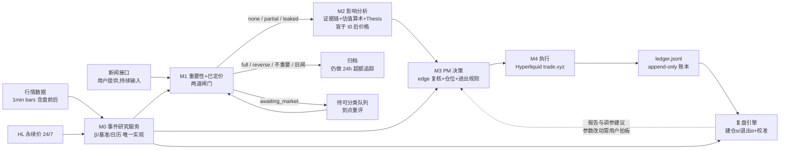

# Delta PM — 美股新闻驱动多空交易系统 PRD

> 状态:**草案,待用户审阅**。本文档只定义产品,不进开发。
> 最后更新:2026-08-22 · 英文版:待同步翻译(审阅定稿后补 `docs/en/`)
> 事实基线:trade.xyz 合约数据为 2026-08-22 经 Hyperliquid API 实测(`dex="xyz"`);已过一轮三视角对抗评审(交易实操 / 工程可行性 / 文风一致性),35 条发现全部吸收。

---

## 0. 一页摘要

**做什么**:把 predict-raven 已验证的 forecasting 能力(证据链 → 幅度判断 → 校准复盘)迁移到美股多空。新闻持续流入,系统判断"市场是否已定价";未定价的,估出影响路径与合理幅度,转成多空仓位,在 Hyperliquid 上 trade.xyz 的美股永续合约执行。

**核心架构 = analyst → PM 双角色**(2026-08-22 用户对话定调):

- **Analyst(模块 M1+M2)**:接新闻 → 判重要性与是否已定价(M1)→ 影响路径、证据链、估值算术、交易 thesis(M2)。forecasting 能力的主场;M2 的估值**盲于新闻后的价格反应**,否则"是否已定价"的比较是循环论证。
- **PM(模块 M3+M4)**:接 thesis → 开不开、开多大、怎么退(M3)→ 下单与仓位管理(M4)。短线退出双轨(估值到位 / 技术破位)加一条系统新增的时间守卫;长线 thesis 三态(兑现且被定价→卖、证伪→止损、否则硬拿)。

**只优化两个目标:胜率、盈亏比**(按短线/长线分桶统计)。不优化"卖在最高点"。

**策略定位**:不和机器抢简单头条(财报数字这类几分钟内定价完毕,实证见 §5),赚**复杂新闻的慢消化**——影响路径需要推理的新闻(供应链传导、监管、订单对 EPS 的影响),市场消化以小时到天计,这正是 forecasting 引擎的相对优势。延迟按分钟级设计,不做速度竞赛。

**分期**:Phase 0 影子模式(只分析不下单,攒校准数据)→ Phase 1 模拟盘 → Phase 2 小真钱 → Phase 3 扩容。每次升级由用户拍板,门槛见 §13。

**与预测市场做法的三个根本差异**:

| | 预测市场(现有) | 美股(本系统) |
| --- | --- | --- |
| 结算 | 事件有明确结算日与二元结果 | 无结算;edge 靠价格路径实现,退出是主动决策 |
| 市场盲测 | 预测生成全程禁读市场价 | **只有 M2 估值盲于新闻后的价格反应**;M1 恰恰要读价格(判"已定价"),M3/M4 全程看价 |
| 输出 | 概率(0–1)+ Brier 校准 | 方向 + 合理幅度区间 + 时间窗 + 失效条件;校准改用区间覆盖率与方向命中率 |

---

## 1. 背景与定位

repo 已有的三块成熟积木(详见 §11 复用矩阵):

- **raven-delta**(`apps/raven-delta`):新闻 → attention gate(0–100 分)→ 全网最早时间溯源(firstSeenUtc,引擎联网核实而非采信来稿声明,VM 上实测识破过旧闻翻炒)→ 受影响股票(方向/幅度/±40% 预期波动区间/操作建议)→ 邮件/WS 推送。**止步于分析展示:无仓位、无 sizing、无执行。**
- **paper-agent**(`services/paper-agent`):自主交易循环骨架——调度器、纯函数决策策略、model-free 止损优先于模型、append-only 账本、每日反思与建仓α/退出α拆解。**数学是预测市场的,须替换为多空永续概念;单写者并发模型也需改造(§4)。**
- **forecast-engine**(`packages/forecast-engine`):多轮证据检索、逐源可信度纪律与贝叶斯归因、market-blind 模式、可续跑档案。**输出是二元概率,缺幅度层。**

缺口:Hyperliquid 执行适配器(repo 零代码,最大工程缺口)、股票行情数据接入、股票原生的 sizing 与风控。新闻**源**由用户提供,采集缺口消解;接入侧(push 收口还是 pull 轮询器)待 §14 Q2 拍板后确定工程量。

**用户方法论输入(2026-08-22 对话,本 PRD 的设计基准)**:

1. 只优化两个目标:胜率、盈亏比。
2. Agent 完全负责买卖点判断。
3. 短线卖出两条基础逻辑:**估值**(签大 AI 单 → 上调明年 EPS → 算出基本面合理涨幅 %)与**看图**(跌下来减一点、破位就卖);试图卖在最高点通常不是最优策略。
4. 长线(周–月)看 **thesis**:如期兑现且被 price-in → 卖出;被证伪 → 止损;其余硬拿。
5. 估值是 forecasting 能做的——analyst 产 thesis,PM 转动作。

## 2. 优化目标与交易哲学

- **胜率**:已平仓 trade 中盈利笔数占比。
- **盈亏比**(profit factor,总盈利 ÷ 总亏损;辅以平均盈利 ÷ 平均亏损):与胜率一起**按短线/长线分桶**统计——短线容许高胜率小盈亏比,长线容许低胜率大盈亏比,混池互相污染结论(paper-agent 的 Brier 混池教训)。
- 两个目标各配一个**防作弊诊断**(只诊断、不优化,§10):单位风险单位时间期望收益(防"压着目标价收割"抬胜率但资金效率崩坏),目标区外残余走势分布(防系统性把 fairImpact 往低了报来同时抬高胜率与捕获率)。
- **不做的优化**:不追求卖在最高点。退出质量用 **thesis 捕获率**(实际盈亏 ÷ 按 thesis 应得盈亏)衡量,永不使用"距最高点差多少"——后者是事后视角,会把 PM 推向持仓过久。
- **动作空间刻意收窄**:`open / add / trim / close / flip / no-trade`,默认 no-trade。长线仓位在 thesis 三态未触发时**禁止调仓**——"硬拿"是显式决策并写入账本,不是没动作。这回应"要不要优化动作"的问题:先不扩动作空间,把六个动作的触发条件做扎实,复盘数据说明需要时再加。
- **一票一仓**:同一标的最多一个净头寸;新 thesis 与在持仓位冲突时由 PM 层裁决(合并/翻转/忽略),不做对冲式双向持仓。

## 3. 标的池(≤20 只)

以 2026-08-22 trade.xyz 实测上线名单裁剪(115 个市场;**STX、SMCI 未上线**)。表中 OI = 未平仓合约名义总额,bp = 基点(0.01%),cross/isolated = 全仓/逐仓保证金:

| 组 | 标的 | 合约事实(实测) | 流动性档 |
| --- | --- | --- | --- |
| Mag 7(7 只) | AAPL MSFT GOOGL AMZN NVDA META TSLA | 全部 20x、可 cross;NVDA OI $126M、GOOGL $138M,点差 ≤2bp | tier-1 |
| 存储(3 只) | MU SNDK WDC | MU/SNDK 10–20x 可 cross、OI $140M+;**WDC 10x 仅 isolated、OI $2.5M、盘口薄**(前 20 档卖侧仅 ~$29k) | MU/SNDK tier-1;WDC tier-3 |
| 半导体/AI 供应链(3 只) | AMD AVGO TSM | 10x,多为 isolated-only;AVGO/TSM 盘口偏薄 | tier-2 |
| 高波动叙事(4 只) | PLTR COIN HOOD MSTR | 10x isolated-only;**MSTR 不在 growth-mode(场地低费率名单,API 可读、场地可动态调整)内,费率 ×10** | tier-2 |
| 补充(3 只) | ORCL NFLX INTC | 10x isolated-only;INTC OI $68M 意外地深 | tier-2(NFLX tier-3) |

合计 20 只。流动性档决定单标的敞口上限(§9)。**备选池**(均已上线):

- 替换候选:MRVL AMAT QCOM ARM DELL NOW CRWD RDDT IBM COST LLY GME RIVN;
- 存储周期的国际表达:SKHY(SK 海力士;**SKHX 是 7/28 oracle 事故涉事的旧市场,SKHY 疑似事故后重开盘,启用前需向场地确认哪个是正主**)、KIOXIA、DRAM 现货指数永续;
- ETF 工具(不占 20 只额度,V2 用于 β 对冲):SMH / SOXL / MAGS。

股票池沿用 `apps/raven-delta/config/stock-universe.json` 运营维护模式(ticker + 中英别名 + tags + beta),新增字段:`hlSymbol`("xyz:AAPL" 格式)、`benchmark`(超额收益基准:半导体/存储 SMH,其余 QQQ)、`maxLeverageOnVenue`、`marginMode`、`liquidityTier`、`consensusBaseline`(当前市场共识基线摘要 + 更新时间戳,供 M1 判 surprise;**基线过期即污染 surprise 判断,每条 NewsSignal 必须记录它引用的基线版本**,刷新机制见 §5)。

## 4. 系统架构与数据流



**M0 事件研究服务(共享库,全新构建)**:β 估计(近 1 年日线)、基准序列、超额收益计算、交易日历与时区、数据源三档标注,**全系统唯一实现**——M1 反应窗、M3 下单前 edge 复核、复盘校准三处全调它,β 与基准版本号写进归档。设立理由:本 repo 2026-07-03 复杂度审计的头号病灶就是同一逻辑多处独立实现(Gamma 客户端 ×6),这里从第一天堵死。

**模块间机器契约**(zod 强制,沿用"prompt 引导思考、schema 保证正确"哲学):

- M1 → `NewsSignal`:指纹、firstSeenUtc + 依据、**expectedDirection(方向)与粗估影响档**、引用的共识基线版本、materiality、pricedIn(六态 + 已实现超额波动 + 成交量 z 值 + 数据依据 + **t_eval − t0**)。
- M2 → `TradeThesis`:标的、方向、类型(短线事件 / 长线 thesis)、fairImpactPct 区间(相对新闻前基线,盲于反应)、影响路径量化链、证据(逐源可信度 + 污染分级)、时间窗、催化剂、falsifiers、pricedInMarkers。
- M3 → `PMDecision`:动作、入场区、size、止损规则及其全部输入(可回放)、目标区、复审计划、冷却期状态、风控裁剪记录(binding constraint + **意图风险 % vs 实现风险 %**)。
- M4 → 账本事件(下单/成交/撤单/funding 结算/场地触发单维护/对账),复用 paper-agent 的 ledger.jsonl 事件族并扩展。

**并发模型(对 paper-agent 模式的实质改造,不是照搬)**:paper-agent 是一条串行 promise 链,搬过来会让一波新闻的分钟级深分析堵死止损 tick。本系统分两层:**M1/M2 分析无状态、并行执行、不进写者队列**(多条新闻同时过闸时按 materiality 排序、同簇合并分析、并发上限 N);**只有 M3 决策 + M4 执行进单写者队列**,且入队后先重读组合快照再裁剪(防 check-then-act 竞态);写者内部快慢两道——止损/对账 lane 可插队建仓决策 lane。

**触发模型**:事件驱动(新闻到达即 M1)+ 定时复审(在持仓每日 1 次、长线每周深评 + falsifier/pricedInMarker 命中即触发)+ 快 tick(10 分钟:止损收紧扫描、挂单管理、场地触发单核对、强平距离监控)。

## 5. 模块 M1:重要性 + 已定价判断

**本系统相对 raven-delta 的最大增量**:raven-delta 的"已定价"只有 24h staleness 启发式;M1 升级为"时间轴 × 价格反应"的量化判断。业界结构可抄(RavenPack 字段设计 + 标准事件研究),两道闸门:

### 闸门 1:重要吗(materiality)——类别优先,不是情绪优先

按序判定,任一不过即归档:

1. **事件类别白名单**:财报/指引、订单与大客户合同、并购、产品与技术节点、监管与诉讼、管理层变动、供应链事件、与标的直接相关的宏观(如对华出口管制之于 NVDA)。白名单外默认不交易。**评级与目标价类单独不过闸**,只作其他类别的佐证。
2. **事实等级**:fact > forecast > opinion。纯观点(KOL 喊单、无新信息的复述)归档。
3. **主体相关性**:标的须是新闻主角(标题级),不是被顺带提到。映射到股票池(universe 别名匹配 + LLM 判定,服务端裁决)。
4. **surprise vs 预期**:对照 universe 的 `consensusBaseline` 打幅度,**永远打"超预期的部分",不打绝对数字**。指引重申、已预告事项落地 ≈ 零 surprise。基线由 agent 在每个标的财报后 + 每两周定期刷新并带时间戳;基线过期 >30 天的标的,surprise 判断降级标注。

### 闸门 2:已定价了吗(priced-in)

**第一层:新闻本身是不是新的**(防"旧闻翻炒 + 新时间戳"):

- 结构指纹 = hash(主体 + 事件类别 + 关键数量级),同指纹 N 天内出现过 → 判重复(RavenPack EVENT_SIMILARITY_KEY 的做法);
- 文本相似度 vs 该标的近 10 条已见新闻(Tetlock staleness)。两层缺一不可:改写绕过文本哈希,旧事件的新细节绕过纯指纹——"旧事件、新事实"单独成类,按增量部分打分;
- firstSeenUtc 溯源沿用 raven-delta 引擎核实机制(联网找全网最早出现并给出依据;来稿时间戳只是提示)。

**第二层:价格是否已经反应**(t0 = 核实后的全网最早时间;全部计算走 M0,超额收益 = r_标的 − β·r_基准,**永不用裸涨跌**,另加同板块 peer 同向检查防宏观误归因):

- **泄露检查窗** [t0−5 交易日, t0):expectedDirection 方向上的显著超额漂移 → `leaked`(并购研究实证:目标公司约 1/3 涨幅发生在公告前)。泄露仍可交易,但 edge 扣除已走部分。
- **反应完成度,按已流逝时间归一**——这是对"2 小时窗口 vs 15 分钟决策"矛盾的正面回答:判定不等窗口走完,而是把 **t_eval 时刻的已实现超额波动**与**该事件类别在 Δt = t_eval − t0 处的预期反应完成率曲线**比较(简单头条类:分钟内应近 100%;复杂传导类:2 小时才过半)。曲线冷启动用粗先验,Phase 0 起用自家数据校准——所以每条 NewsSignal 强制记录 Δt。发现晚的新闻(Δt 已 2h+)天然拿到完整窗口,语义一致。
- **成交量确认**:反应窗成交量 z 值(对同一分钟时段历史基线)。有价无量存疑;**有量无价 + 复杂新闻 = 市场还在消化,恰是可交易状态**。
- **盘外与基准缺失**:财报重估大头在盘后(盘后成交量比平日高约两个数量级),只看 9:30–16:00 会把盘后反应误读成跳空。数据依据三档显式标注:`rth_bars`(盘中 1min)> `extended_bars`(盘前后 1min,要求最低成交额,优先买卖中间价)> `hl_perp`(trade.xyz 永续价,24/7 可用但有 funding 基差且盘口薄,只作方向参考,不进超额计算)。盘前后 ETF 基准几乎不打印,此时**基准取 0、分类带宽放宽一档并标注置信度降级**(V2 可接指数期货作盘外基准)。凌晨 3 点这类完全不可分类的时段,信号进 `awaiting_market` 态排队,到首个可分类时刻重评;**延迟预算从"首个可分类时刻"起算**,不是从 t0。
- **归档信号也追踪**:被判 `full`/不重要的信号照记 24h 超额走势(只记账不分析)——否则 Phase 0 的混淆矩阵没有"错杀"列。

**输出**:`pricedIn.status ∈ {none, partial, full, leaked, reverse, awaiting_market}` + 已实现超额波动 + 依据。`none / partial / leaked` 进 M2;`reverse`(价格反着新闻方向走)V1 只标注归档,fade(逆势接)留 Phase 3 实验。

**延迟预算**(从首个可分类时刻起,总目标 ≤15 分钟,分解):指纹去重 + 类别闸门(规则 + 廉价 LLM)≤2 分钟;firstSeen 核实 + M2 深分析 ≤10 分钟(复用 forecast-engine 的推理路径但**砍掉报告渲染——repo 实测渲染占一轮 12–15 分钟的 95%**,纯推理在预算内);M3 决策 + M4 下单 ≤2 分钟。简单头条本来不属于我们:2016 年后财报数字定价以分钟计,近乎有效。

## 6. 模块 M2:影响分析(基本面量化因子)

M1 放行的信号进入深度分析。**关键纪律:估值盲于 t0 之后的价格**——analyst 可看新闻前的估值基线(市值、forward P/E、共识预期),不许看新闻后的价格反应,否则 fairImpact 被已实现走势锚定,"是否已定价"失去意义。

**盲测的实现比预测市场难,PRD 不承诺做不到的确定性**:forecast-engine 的 market-blind 靠域名黑名单,但股票的价格反应不住在特定域名——事后报道正文几乎都带"shares jumped 8%",新闻原文也常内嵌走势。因此机制改为:输入与证据**文本级价格反应清洗**(把 t0 后的价格描述片段滤除/遮蔽)+ **污染分级**(硬污染 = 估值明显锚定已实现走势 → thesis 否决;软污染 = 文本残留但推理链未引用 → 标记降权)。**污染率本身是 Phase 0 必测指标**,用数据定否决线,不拍脑袋。

### 估值算术(短线事件类的核心)

标准分析师链条,LLM 分步执行(有实证:Kim–Muhn–Nikolaev 2024,GPT-4 用模仿分析师步骤的 CoT——分步推理——对未来盈利变化方向命中 60.35%,超分析师共识约 7pp):

1. 新闻 → 影响哪些科目(收入/毛利率/费用/股本)→ 量化增量(带假设与区间);
2. → 明年 EPS 修正 %(**相对共识,不是相对上年**);
3. → 合理股价变动 %:估值倍数不变时 ≈ EPS 修正 %;新闻改变增长/风险认知时才动倍数(敏感性:±1x 倍数 ≈ EPS 的量级);
4. 一次性事项(罚款/和解/资产出售)不走 EPS:合理变动 ≈ 税后净现值 ÷ 市值;
5. 输出 `fairImpactPct {min, max, point}` + 每步假设的证据与可信度(复用 forecast-engine 逐源归因纪律)。

### Thesis 构造

- **类型判定**:影响在天级窗口兑现(财报反应、单一订单)→ `event_trade`;需多季度展开(产品周期、格局变化、周期反转)→ `thesis_trade`。同一条新闻可两者都产,M3 分开管理。
- **falsifiers 必填且可检验**,并且**至少一条是价格无关、周频可核实的条件**(如"下季 HBM——高带宽显存——出货指引低于 X"是季频,还需配周频条件如"关键客户公开否认/竞品官宣同规格产品"),否则 M2 退回重写——长线仓在两次财报之间不能只靠灾难止损裸奔。
- **pricedInMarkers 必填,V1 只允许两类可检验条件**:价格类(相对基准累计超额 ≥ fairImpact 的 ~80%)与公开事实类(公司确认里程碑落地)。**禁止引用卖方分析师行为**("卖方普遍上调")——系统没有共识修正数据源,写了也查不了;等 §14 Q3 数据源拍板后再放开。
- 证据链、可信度分级、未验证源限幅、检索轮次纪律:沿用 forecast-engine 现有 guardrail。

## 7. 模块 M3:PM 决策

### 7.1 入场

- **Edge 复核(下单前最后一步,必做)**:用下单时刻实时价经 M0 重算已实现超额,`residualEdge = fairImpact − 已实现`。分析要花分钟,价格在跑,不用快照。
- **保守口径入场**:门槛比在 fairImpact 的**保守端**(做多用 min、做空用 max),不是 point——LLM 幅度估计区间宽且偏乐观,用 point 会让这道门形同虚设:`|fairImpact 保守端 − 已实现| ≥ max(往返成本 × 3, 0.5 × 日波动)`。
- **逆势守卫**:若 t0 以来已实现超额与 thesis 方向**相反**超过 0.3 × 日波动,不得按"edge 变大了"直接进场(公式上 residualEdge 确实变大,但那是市场在反对你)——改判 `reverse`,回炉重新 M2 分析。
- **成本口径**:往返成本 = taker 费(growth-mode 0.009%,可忽略;MSTR ×10 例外)+ 滑点预算(按流动性档)+ **带符号的 funding**(资金费:永续合约多空双方按小时互付、把合约价拉向标的价的机制)按持有期折算——空头常是收方,做空可能是负成本,按实测实时值算,基线与范围见 §8。
- **事件日历守卫**:接入财报/宏观事件日历。短线仓**默认不持过自家财报**(除非 thesis 就是该财报,显式 flag);已持仓临近计划内二元事件,T−1 减半或平。理由:4% 止损兜不住财报隔夜跳空 8–20%,风险预算在跳空面前是虚构的。
- **冷却期**:同标的止损后 72h 内禁止同方向重进(paper-agent 三进三止损的教训,V1 内置)。

### 7.2 Sizing

弃用 quarter-Kelly(预测市场专用)。**固定风险法**:

```
名义 size = equity × 单笔风险预算 ÷ 止损距离%
实际杠杆 = min(3x, 1 / (2 × 该标的单日最大历史波动))
```

单笔风险预算默认 1%(高置信 1.5%),再经风控裁剪(§9)取 min。裁剪走 applyTradeGuardsDetailed 同款架构:只向下裁、记 binding constraint、低于最小单弃单不上凑,**并新增"意图风险 % vs 实现风险 %"逐笔记账**——因为敞口上限经常在风险预算之前 bind,这个差值必须可见,不能让"1% 风险"停留在纸面。

三笔算例(说明约束如何咬合):

- $5k、NVDA(tier-1 上限 30%)、4% 止损:风险法名义 $1,250(25% equity)< 上限 $1,500 → 风险预算生效,实现风险 = 意图风险 = 1%。
- $5k、NVDA、2% 止损:风险法名义 $2,500 → 被 30% 上限裁到 $1,500,实现风险 0.6%。**止损越紧越容易被敞口上限压住,这是接受的行为**,差值入账本。
- $2k、WDC(tier-3 上限 5%)、5% 止损:风险法 $400 → 裁到 $100,实现风险 0.25%,勉强够 $50 最小单——**小资金阶段薄流动性标的实际不可交易,预期内**。

### 7.3 退出

**短线(event_trade,天级)三条触发,先到先执行**(前两条即用户的"估值/看图"双轨,第三条是系统新增守卫):

| 轨 | 触发 | 说明 |
| --- | --- | --- |
| 估值轨 | 每日复审重算 residualEdge:价格进目标区(超额口径)**或 edge 转负** | thesis 兑现即收割,不贪最高点;"净 edge 为负就卖"的现行退出标准在这里延续 |
| 技术轨 | 破位:跌破 harness 确定性计算的止损位 | 见下,规则可回放 |
| 时间轨 | t+horizon 到期:edge 已转负 → 平仓;edge 仍正 → 强制复审,复审通过可展期一次并记账本 | 防短线单变"被套长线单" |

**技术止损是确定性菜单,不是 LLM 自由发挥**(否则止损质量不可审计):初始止损 = max(入场价 − 1.5 × ATR(20 日)(ATR = 平均真实波幅,衡量日常波动的技术指标), 入场前最近盘中摆动低点);价格走到目标区 50% 后启动移动止损(入场后最高收盘 − 2.5 × ATR,只升不降)。LLM 在菜单内只能**收紧**、不能放宽;止损规则与全部输入写入 PMDecision,退出可回放。执行层面 model-free:止损检查在 LLM 评估之前跑(paper-agent 的保证是"**模型**宕机也触发";"**进程**宕机也触发"靠场地侧触发单,见 §8)。

**长线(thesis_trade,周–月)三态机,每周深评 + falsifier/pricedInMarker 事件触发**:

| 态 | 条件 | 动作 |
| --- | --- | --- |
| 兑现且被定价 | pricedInMarkers 命中(累计超额 ≥ fairImpact 的 ~80%,或公司确认里程碑) | 卖出/分批 trim |
| 证伪 | 任一 falsifier 被证据确认 | 止损,不等回本 |
| 其余 | — | **硬拿**,账本记 `hold_by_thesis`,禁止情绪化调仓 |

**三条维护性修订(对用户口述"其余硬拿"的机器化补丁,是否接受见 §14 Q5,不接受则严格硬拿)**:

1. 灾难止损:浮亏达入场风险预算 2 倍无条件砍——falsifier 检测可能滞后,价格不会;
2. horizon 到期强制重估:重新跑 M2,thesis 在当前事实下重新够格才能续持,"没做新分析"默认平仓——防 thesis 无限漂移;
3. funding 拖累触发:累计已付 funding > fairImpact.point 的 25% → 强制复审并显式 keep/trim 记账——防"不死不活的 thesis 白白流血"(叙事股 funding 极端时见 §8 实测)。

### 7.4 组合层

一票一仓;相关簇敞口上限(§9):一条 AI capex 新闻打穿 NVDA/AVGO/MU 时,PM 挑 residualEdge 最大的 1–2 只表达,不全开(paper-agent 伊朗题材 5 仓同驱动的教训)。每日复审所有仓位,短线仓复审即估值轨的持续重估(见 7.3 表,不是额外第三套规则);长线仓由三态机管辖。

## 8. 模块 M4:执行(Hyperliquid / trade.xyz)

**合约事实**(2026-08-22 实测 + trade.xyz 文档;本节是场地事实的唯一维护处):

- 标准 Hyperliquid REST/WS,info 请求带 `dex:"xyz"`,币名 `"xyz:AAPL"`,下单 asset id = 100000 + dexIndex×10000 + index;官方 Python SDK 支持 builder dex。USDC 保证金,线性合约现金交割。
- **24/7 交易**。外部 oracle 覆盖 24/5(周日 20:00–周五 20:00 ET,含盘前/盘后/Blue Ocean 隔夜);周末与节假日为 internal session:oracle 切为盘口 EMA,受 **Discovery Bounds** 约束(个股 ±5–10%,mark 同时被限制在最后外部价的 1/杠杆上限 内),周一开盘 oracle 跳回外部真实价。
- 费率:growth-mode 名单内 taker(吃单)0.009% / maker(挂单)0.003%,便宜到可忽略;MSTR 不在名单,×10;growthMode 是 API 动态 flag,运行时读取不硬编码。
- **Funding 实测(2026-08-22,唯一数据源,§7.1 引用此处)**:全场范围 −0.049% ~ +0.021%/小时(≈ −1.2% ~ +0.5%/日),中位数恰为基线 0.000625%/小时(≈5.5% 年化);热门标的示例:MU +0.0018%/hr、AVGO +0.0028%/hr、MSTR +0.0012%/hr。空头在溢价时段是**收方**。
- 流动性分层:Mag7/MU/SNDK 深($50k 内随便打,点差 ≤2bp);WDC/AVGO/NFLX 薄,只挂限价/分批。

**执行策略**:maker-first 限价 + TTL(限时未成交自动转市价)——沿用 paper-agent hybrid 模式;滑点预算按流动性档;退出单一律 reduce-only(只减仓、不会反向开新仓的订单标记);每仓显式设杠杆。**所有订单带 cloid(客户端订单号)保证重试幂等;进程重启后先对账在途订单再恢复调度。**仓位与账本每 tick 与场地 `clearinghouseState` 对账,不一致即告警停机(单一状态源)。

**场地侧止损地板(进程宕机保护)**:每仓建立的同时,在场地挂 reduce-only 触发止损单作为灾难地板价;本地 10 分钟扫描只做**收紧/上移**;对账循环把"场地触发单存在且价位正确"列为核对项。本地进程死了,场地单还在。

**场地风险与守卫**(这是 perp,不是股票):

1. **Oracle 尾部风险**:2026-07-28 SKHX 事件——韩国 Nextrade 盘前 11 股异常打印流入 oracle,连环强平 ~$57M(场地事后全额赔付,不能指望下次)。守卫:oracle 与外部行情源背离 >2% 且外部无对应变动 → **只冻结 open/add/flip,止损与减仓路径永续在线**(冻结退出等于拆掉降落伞),止损触发需连续 2 个 tick 或外部源确认(防被单根坏打印扫掉),同时即时告警用户。
2. **强平距离**:实际杠杆按 §7.2 公式(如 MSTR 单日 20% 波动 → 上限 2.5x,比 3x 更紧的那个生效);保证金余量 ≥ 单日最大历史波动 ×2 为硬性校验。
3. **周末政策(默认,§14 Q6 拍板)**:internal session 不开新仓;周五外部 session 结束前复审全部在持仓——短线仓默认减半或平,长线仓过周末的,sizing 按"周一跳空 2 倍止损距离成交"情景重新校验保证金(周末止损成交价是被 Discovery Bounds 压制的人造价,周一 oracle 跳回真实价,**实际成交 ≈ 周一跳空价而非止损价**,风险算术必须按后者)。internal session 期间技术轨/估值轨**挂起**,只留强平距离守卫与灾难地板(按"最后外部价 ± bounds"口径);周一外部 oracle 恢复后先对账再恢复自动。
4. **公司行为**:场地**未公布拆股调整政策**(文档全文检索确认);分红不付给 perp 持有人(oracle 除权自然回落)——多头跨除权日吃跌、空头理论上白赚,场地是否用 funding 补偿**未经验证**;除权日进事件日历,Phase 2 前用一次真实分红事件实测行为,验证前跨除权日仓位需 flag。拆股公告 → 该标的暂停交易直到确认处理方式。
5. **下架风险**:实测已有 14 个市场 isDelisted,deployer 可下架任何市场;长线仓把"场地下架"列为系统性 falsifier。
6. **合规注意**:trade.xyz ToS 限制美国/加拿大/英国人士及受制裁辖区。账户主体与接入方式的合规性由用户确认,系统不做规避设计。

**密钥与账户**(repo 第一个直连交易所的真钱系统,单独成段):使用 Hyperliquid agent/API wallet 模式——交易签名权与提币权分离,**主钱包私钥永不上 VM**;agent key 走 env/secrets 惯例(不入库、不进日志、不进归档);提币白名单 + 定期轮换;Phase 2 升级门槛包含 M4 适配器在 **HL testnet 完成全动作族实弹验证**(签名、asset id 算术、reduce-only/触发单语义)——book-sim 只验策略不验适配器。

## 9. 风控

参数全部 env 化(`DELTAPM_*` 命名空间)。**下表全部默认值需用户逐行拍板(§14 Q4),任何后续改动需用户确认写入 env,agent 不得擅自改**。执行层裁剪,不靠 prompt 自觉:

| 参数 | 默认 | 说明 |
| --- | --- | --- |
| 单笔风险预算 | 1%(高置信 1.5%) | 打到止损的最大亏损占 equity 比例 |
| 单标的名义敞口 | tier-1 ≤30% / tier-2 ≤15% / tier-3 ≤5% | 按流动性档;算例见 §7.2 |
| 组合 gross 敞口 | ≤150% equity | 多空绝对值之和 |
| 组合 net 敞口 | ≤100% equity | 多减空 |
| 相关簇敞口 | 单簇 gross ≤40% | 簇 = universe tags(ai-infrastructure / storage / crypto-beta…) |
| **隔离保证金占用** | 各 isolated 仓保证金合计 ≤50% equity | 20 只中 13 只 isolated-only,不设上限会把 equity 锁干 |
| 实际杠杆 | min(3x, 1/(2×单日最大波动)) | 保证金余量 ≥ 单日最大波动×2 硬校验;两条是同一件事的两面 |
| 日亏损开关 | 当日已实现+浮动亏损 ≥3% equity → 当日停新开 | 只停开仓,止损照跑 |
| HWM 回撤停机 | ≥15% → 停一切**新增风险**;止损/减仓/对账/场地触发单维护照常;恢复需用户解锁 | HWM = 账户净值历史高点。**较现行 20% 收紧,属政策变更,单独待拍板**;不选"触发即清仓"是因为市价清 13 只薄流动性 isolated 仓本身就是风险事件 |
| 事件日历规则 | 短线不持过自家财报(thesis 即事件除外);T−1 减半;除权日 flag | §7.1、§8 |
| 冷却期 | 止损后同标的同方向 72h | §7.1 |
| 最小单 | $50 名义 | 低于即弃,不上凑 |

裁剪架构复用 `applyTradeGuardsDetailed`(只向下裁 + binding constraint 记账),**新增 free-collateral 与 margin-buffer 两个一等公民约束**——现有实现只有名义 USD 维度,保证金维度是新的。停机态 fail-closed:恢复需用户显式解锁。

## 10. 复盘与指标

回答"复盘卖出和复盘买入有什么本质区别":有,系统按 PR #102 验证过的**建仓α / 退出α 拆解**分开审计,并沿用 reflect.ts 的 **episode 口径**(支持 add/trim 分批:每个建仓-退出 episode 独立分解,α 恒等式按 episode 成立)。股票版的 counterfactual 基准 = **thesis horizon 末的实际价格**,horizon 在信号时刻定死、写入账本不可变(horizon 定歪会同时污染两个 α——horizon 合理性单独作为 M2 校准维度)。

**建仓复盘(审 analyst + 入场)**:

- 信号真伪:M1 判"未定价"后,标的在 thesis 窗口内超额收益方向是否兑现(按短线/长线分桶;归档信号的 24h 追踪提供"错杀"列,混淆矩阵才完整);
- edge 衰减:信号时刻 → 成交时刻损失了多少 residualEdge(管线延迟的真实成本);
- M2 校准:fairImpact 区间覆盖率(目标 ~70%:太宽被盈亏比暴露,太窄被覆盖率暴露)+ 污染率。

**退出复盘(审 PM,按退出轨归因)**:

- 估值轨:目标区之后的残余走势分布——**只作 M2 校准与防作弊监控**(残余持续偏大 = fairImpact 被系统性压低来刷胜率),不是退出质量指标;
- 技术轨:破位卖出后继续下跌的比例(止损菜单参数合理性的直接检验,规则确定性保证了这个统计有意义);
- 长线三态:pricedInMarker 命中到执行的延迟、falsifier 确认到止损的延迟;
- thesis 捕获率 = 实际盈亏 ÷(fairImpact point × size),短线目标 ≥60%。

**两套口径并行,明示不调和**:决策与校准用**超额收益**(M0 计算),执行与止损用**原始价格**(真实亏损是 raw)。单边行情下两者会分叉——β 杀跌可以扫掉超额口径完全健康的仓位,这是 V1 接受的现实;仪表盘从第一笔模拟单起并列 **raw PnL 与 β 对冲后 PnL** 两列,分叉持续偏大时 Phase 2 起用 SMH/MAGS 永续做小额 β 对冲(工具已在场,§14 Q10)。

**仪表盘**:胜率、盈亏比,按 {短线, 长线} × {多, 空} 四桶月度出数;防作弊诊断两项(§2);辅助:fee/funding drag(逐仓记实收实付 funding)、滑点、冷却期拦截、binding constraint 分布、意图 vs 实现风险差。

**归档**:`runtime-artifacts/delta-pm/{signals/, theses/<id>/, portfolio.json, ledger.jsonl, reports/}`,沿用 artifacts 约定;每日反思复用 paper-agent reflect 骨架(Brier 换成上述校准指标)。后续加 `/live-delta-pm` 复盘页(照抄 /live-predict-raven 的 forecast-api + 门禁模式)。

## 11. 与现有资产的复用矩阵

| 现有资产 | 直接复用 | 需改造 | 不适用 |
| --- | --- | --- | --- |
| raven-delta | ingest API + token 门;universe 运营模式;firstSeenUtc 溯源;attention gate 骨架;邮件/WS 推送;zod 契约哲学 | schema 扩展成 NewsSignal/TradeThesis(expectedMovePct 是 fairImpact 雏形);闸门 2 全新 | 纯展示型 action 文案 |
| paper-agent | ledger.jsonl 事件溯源;纯函数策略层;model-free 止损优先;污染/饱和否决;反思骨架;建仓α/退出α(episode 口径) | **调度与并发:单串行链改两层模型**(分析并行、决策执行单写者、快慢双 lane,§4);账本事件加 funding/杠杆/触发单族 | 全部 Polymarket 数学(P(YES) edge、二元结算、Gamma/CLOB 客户端) |
| forecast-engine | 证据链+逐源可信度+贝叶斯归因;档案可续跑;analyst-in-the-loop | **盲测机制重做**:域名黑名单 → 文本级价格反应清洗 + 污染分级(§6);增加幅度层(二元概率 → fairImpact 区间);砍报告渲染保推理路径(延迟预算,§5) | — |
| 风控 | applyTradeGuardsDetailed 架构;env 参数政策;fail-closed 停机 | 新增 free-collateral / margin-buffer 约束维度;参数股票化 | quarter-Kelly 公式 |
| 基建 | 东京 VM compose(新容器即插)、forecast-api 服务模式、artifacts 约定、部署铁律(clean-untar) | — | — |
| **全新构建** | — | **① Hyperliquid 适配器**(签名/agent wallet/下单 cloid 幂等/场地触发单管理/仓位与 funding 同步/强平监控/行情 WS——最大工程缺口,testnet 先行);**② M0 事件研究服务**(β/基准/日历唯一实现);**③ M1 闸门 2**(指纹去重 + 反应完成度曲线);**④ M3 策略层**(sizing/止损菜单/三态机);**⑤ 股票行情接入**;**⑥ 事件日历**(财报/宏观/除权) | — |

**行情数据(§14 Q3 拍板,直接影响 Phase 0 成立性)**:Phase 0 的核心产出是 M1 混淆矩阵,而闸门 2 需要盘中+盘前后 1min bars、每标的 60+ 天分钟级量能基线、基准 ETF 同窗序列——**免费方案给不了这些,"先免费后购买"等于把 Phase 0 的校准产出归零**。推荐:Polygon(现名 Massive)Stocks Advanced ~$199/月作为 **Phase 0 前置依赖**;LongPort OpenAPI(用户已有长桥账户)作候选,需先验证盘前后分钟数据覆盖与配额;若坚持零成本起步,Phase 0 门槛须降级为日线粒度并接受 priced-in 机制核心失效(反应窗/量能确认全废)——不推荐。

## 12. 非目标

- 不做新闻源采集(用户提供;系统只做核实与消费)。
- 不做速度竞赛:不抢简单头条秒级定价,不做盘口/微结构 alpha,不做做市。
- 不做期权、不做多场地执行(只 trade.xyz)、不做加密币对。
- 不做公开产品:V1 是内部系统,复盘页走门禁。
- 不自动调风控参数:复盘引擎只产建议,改参数永远经用户。
- V1 不做 fade(reverse 信号只标注)、不做 β 对冲持仓(只做对冲后口径的度量)。

## 13. 分期计划与升级门槛

统计上诚实的说明:Phase 0/1 的样本量(n≈30–60)不足以从统计上"证明" edge(55% vs 50% 的方向命中在 n=30 时置信区间 ±18pp)。因此**门槛数字是评审参考线,不是自动闸门**;每次升级 = 数字 + 定性证据(逐仓复盘、事故清单)交用户拍板。真正有统计功效的检验在 Phase 2 长样本累积后。

| 阶段 | 内容 | 升级评审(参考线 + 用户拍板) |
| --- | --- | --- |
| **Phase 0 影子模式**(4–6 周;**前置:1min 行情数据到位**) | 接新闻接口 + 行情;M1/M2 全速跑,M3 出纸面决策,**不下单**;每日报告 | 被追踪信号(含归档追踪)≥60;M1 方向命中报告值 + 置信区间;fairImpact 覆盖率 ≥60%;污染率实测并定否决线;反应完成度曲线首版校准;管线零静默失败 |
| **Phase 1 模拟盘**(4–6 周) | M4 对 l2Book(逐档盘口)走 book-sim 模拟成交;完整账本 + 复盘;raw/对冲双口径仪表盘上线 | 短线桶 n≥30:胜率 ≥50% 且盈亏比 ≥1.3(参考线,附置信区间);长线仓不设数字门槛,逐仓人工复盘;风控/对账/冷却/场地触发单逻辑全演练 |
| **Phase 2 小真钱** | 独立钱包 $2k–5k,agent wallet,真实下单;**前置:HL testnet 全动作族验证通过** | 6–8 周:短线桶胜率落在模拟盘 −5pp 以内且盈亏比 −0.2 以内(n≥15);**零风控事故**(定义:强平、对账不一致、止损应触发未触发、参数越权改动,任一即事故);一次真实除权日行为验证完成 |
| **Phase 3 扩容** | 加资金、扩标的池、β 对冲工具化、fade 实验、共识数据源接入 | 逐项用户拍板;长线桶累计 n≥10 后出首份长线专项复盘 |

Phase 0 攒的校准数据(混淆矩阵、反应曲线、覆盖率、污染率)是系统资产:没下一分钱注之前,这套方法就能被证伪或证实。

## 14. 开放问题(需用户拍板)

1. **标的池终版**:WDC 去留(流动性差但存储组只剩 3 只);SKHY/KIOXIA/DRAM 指数是否入存储组;备选池取舍;tier 划分认可否(§3)。
2. **新闻接口契约**:push(POST 到我们 ingest)还是 pull(我们轮询)?字段(至少 text/url/时间戳/来源)?预计条数/天与峰值?
3. **行情数据**:批准 Polygon ~$199/月作为 Phase 0 前置?还是先花时间验证 LongPort OpenAPI?(免费方案的代价见 §11,不推荐)
4. **§9 风控表逐行确认**;特别单列:HWM 停机线从现行 20% 收紧到 15%,接受否?
5. **长线"硬拿"的三条维护性修订**(2× 灾难止损 / horizon 到期重估默认平 / funding 拖累强制复审,§7.3)——接受,还是严格硬拿到 falsifier 确认?
6. **周末政策**:internal session 不开新仓 + 短线仓周五减半 + 双轨退出挂起(§8),接受否?
7. **短线 vs 长线初期侧重**:建议 Phase 0–1 以短线事件单为主(反馈周期快,校准数据攒得快),长线 Phase 1 后半放开——同意否?
8. **合规主体**:trade.xyz ToS 辖区限制(§8),接入主体与方式你确认。
9. **部署与账户**:东京 VM compose 新容器 + 独立钱包 + agent wallet 模式(主钥离线),有异议吗?
10. **Phase 门槛参考线数字**(§13)与 β 对冲引入时点(§10):按建议走还是调整?

---

*研究底稿:trade.xyz 合约与流动性实测(API 直查)、priced-in 方法论(RavenPack 字段设计/事件研究/PEAD 与盘后定价实证)、repo 资产逐文件核对、三视角对抗评审 35 条发现,完整出处随 PR 描述归档。*
