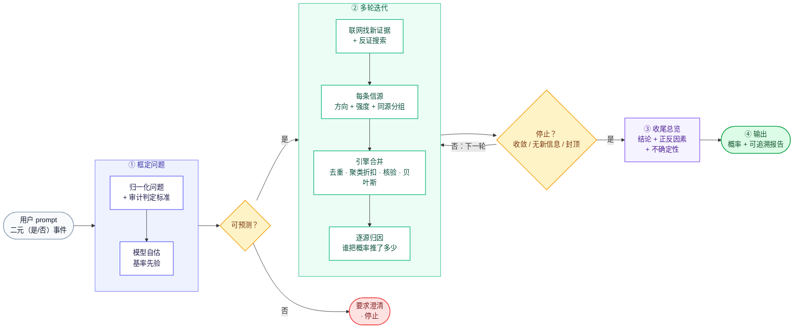
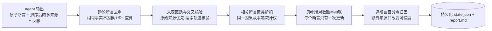
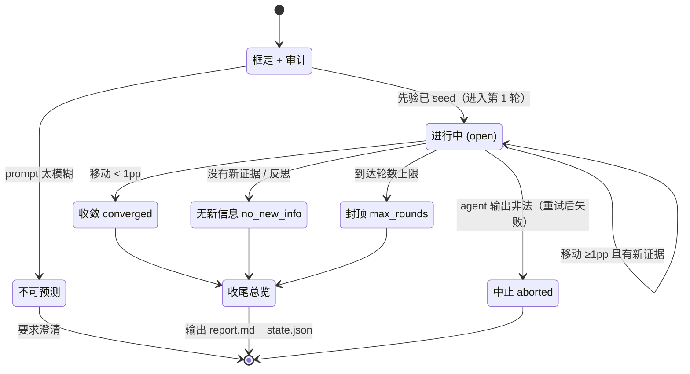

# 预测流程图（迭代式二元事件预测引擎）

> 用于展示。主图一张讲清全流程；想深入再用文末的可选细节图。
> Mermaid 源码 —— 贴进 Notion / Typora / VS Code / GitHub，或在 https://mermaid.live 渲染导出 PNG/SVG。

## 主图 · 一张图看懂预测流程（横向）



### 讲解时一句话带过每个阶段

| 阶段 | 一句话 |
| --- | --- |
| ① 框定 | 把模糊的 prompt 变成"怎么算赢"说清楚的二元问题，并给一个起点先验 |
| ② 迭代 | 每轮联网找新证据，逐条打分，引擎用贝叶斯把它们合成概率——反复几轮 |
| ③ 收尾 | 通盘给一个结论：为什么是这个概率、正反在哪、不确定性是什么 |
| ④ 输出 | 一个概率 + 一份每步可追溯的报告 |

> 核心一句话：**引擎拥有那个数。** agent 只判断"每条证据多强、朝哪边"，概率由引擎确定性算出——所以可追溯、不会被凭空捏造。

---

## 纯文本版（无法渲染 Mermaid 时直接用）

```
                用户 prompt（二元事件）
                        │
            ┌───────────▼───────────┐
            │ ① 框定                 │
            │   归一化问题 + 审计标准  │
            │   模型自估基率先验       │
            └───────────┬───────────┘
                        ▼
                    可预测? ──否──► 要求澄清·停止
                        │是
            ┌───────────▼───────────┐
            │ ② 研究焦点中心           │
            │   拆问题·定唯一模型       │
            │   定检索方向·来源优先级   │
            └───────────┬───────────┘
                        ▼
            ┌───────────────────────┐
            │ ③ 多轮迭代（默认3轮）   │◄──────┐
            │   广搜·原始来源·反证     │       │
            │   每断言: 多来源交叉核验 │       │ 否:下一轮
            │   引擎: 甄选·去重·聚类   │       │
            │         ·贝叶斯更新      │       │
            │   一个断言只更新一次     │       │
            └───────────┬───────────┘       │
                        ▼                    │
                    停止? ────────────────---┘
                        │ 收敛/无新信息/封顶
                        ▼
            ④ 收尾总览(结论+情景+监控+缺口)
                        ▼
            ⑤ 输出: 概率 + 可读可追溯报告
```

---

## 附录 · 可选细节图（主图够用时可不展示）

### A. 单轮内部：引擎怎么把信源变成概率



### B. 状态机：一次预测的生命周期


