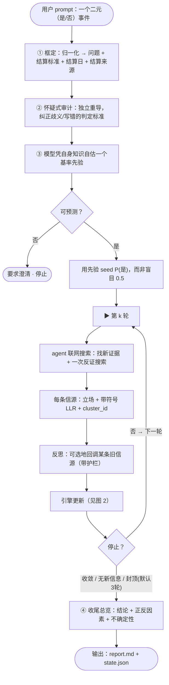
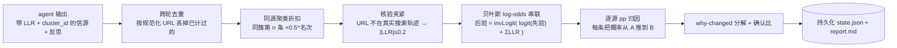
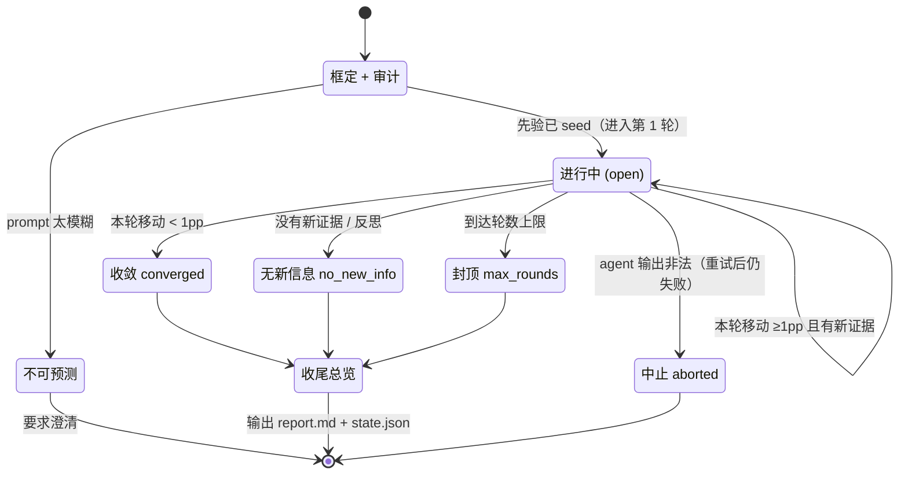

# 预测流程图（迭代式二元事件预测引擎）

> 用于展示。Mermaid 源码，可贴进支持 Mermaid 的工具，或在 https://mermaid.live 渲染成 PNG/SVG。
> English labels available on request.

## 1. 高层流程（一次预测的全貌）



## 2. 单轮内部（引擎怎么把信源变成概率）



> 红线：**引擎拥有那个数**。agent 只给"每条信源多强、朝哪边"（LLR），概率由引擎确定性算出——所以每一次移动都可追溯、不会被凭空捏造。

## 3. 状态机（一次预测的生命周期）



## 关键机制对照（讲解用）

| 环节 | 防的是什么问题 |
| --- | --- |
| ② 怀疑式审计 | 给"错的问题"算出漂亮答案（判定标准写偏） |
| ③ 自估先验 | 起点盲目 0.5，对真实基率 10%/85% 的事只能靠运气 |
| 反证搜索 | 只搜支持现有倾向的证据 → 自我说服棘轮 |
| 聚类折扣 | 一条新闻被 5 家转载，被当 5 条独立证据 |
| 核验夹紧 | agent 编造一个没真访问过的 URL，照样推动概率 |
| 反思（带护栏） | 旧信源已过时/被推翻，却一直焊在概率里 |
| 引擎拥有数字 | agent 直接给概率 → 不可追溯、可能脑补（demo 问题） |

---

### 纯文本版（无法渲染 Mermaid 时直接用）

```
用户 prompt（二元事件）
   │
   ▼
① 框定 ─► ② 审计 ─► ③ 自估先验 ──► 可预测？──否──► 要求澄清·停止
                                      │是
                                      ▼
                          用先验 seed P(是)（非 0.5）
                                      │
          ┌───────────────── 第 k 轮 ◄─────────────────┐
          ▼                                            │
   联网搜索(新证据 + 反证)                               │
          ▼                                            │
   每源: 立场 + LLR + cluster_id                        │ 否→下一轮
          ▼                                            │
   反思(回调旧源, 带护栏)                                 │
          ▼                                            │
   引擎更新: 去重 ► 聚类折扣 ► 核验夹紧                    │
            ► log-odds 串联 ► 逐源 pp 归因 ► why-changed │
          ▼                                            │
        停止? ───────────────────────────────────────-─┘
          │ 收敛 / 无新信息 / 封顶(默认3轮)
          ▼
④ 收尾总览(结论 + 正反因素 + 不确定性)
          ▼
   输出: report.md + state.json
```
